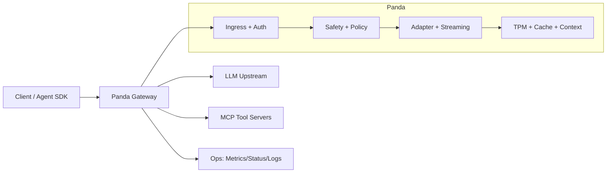

# Panda

**Panda is a Rust AI gateway** that sits between your clients (apps, agents, SDKs) and model providers. It speaks an **OpenAI-compatible HTTP API** on the front, and forwards to your chosen upstream—while adding **policy, identity, budgets, MCP tools, caching, safety, and observability** in one place.

---

## What is Panda?

Panda is a **specialized reverse proxy for LLM traffic**. Unlike a generic API gateway that mostly cares about TLS and routing, Panda treats **prompts, tokens, tools, and streaming bodies** as first-class: the same request carries auth context, spend limits, optional Wasm checks, and MCP orchestration.

You run a single binary with a **YAML config** (`panda.yaml`). Clients keep using familiar paths like `/v1/chat/completions`; Panda enforces your rules before traffic hits OpenAI, Azure, Anthropic, Ollama, or any **OpenAI-compatible** endpoint.

---

## Why do we need it?

| Without a focused AI gateway | With Panda |
|------------------------------|------------|
| Identity and rate limits live in ad-hoc middleware | **JWT/JWKS**, trusted edge headers, and ops endpoints in one model |
| “How much did we spend?” is log archaeology | **TPM-style budgets**, optional semantic cache, `/tpm/status` |
| Tool use is custom glue per app | **MCP host**: intercept tool calls, run servers, optional streaming tool loops |
| Safety is “hope the model behaves” | **Prompt safety, PII hooks, Wasm plugins** on the data plane |
| Streaming hangs tie up clients | **SSE guards** (first-byte and idle-between-chunks timeouts), graceful drain |

**Rule of thumb:** if you only need TLS and path routing, use your existing edge. If you need **governed, observable, tool-aware AI traffic**, Panda is the layer for that.

---

## What Panda can do

- **OpenAI-shaped ingress** — Chat completions and streaming (SSE); adapter path for other provider protocols where configured.
- **MCP** — Host MCP tool servers (stdio/SSE patterns); tool-call interception and multi-round follow-ups.
- **Operations** — `/health`, `/ready`, `/metrics`, `/mcp/status`, `/tpm/status`; optional OTLP traces; graceful shutdown with drain.
- **Policy & extensibility** — JWT scopes, prompt safety, PII scrubbing, **Wasm** plugins (request/body/stream hooks).
- **Performance** — Rust + rustls; stream-native path; optional `mimalloc` for long-lived workloads.
- **Enterprise (opt-in)** — SSO for the developer console, hierarchical budgets (Redis), model failover / parity map. See [`docs/enterprise_track.md`](docs/enterprise_track.md).

---

## QuickStart (standalone)

The fastest path is **Cargo** against a local or remote OpenAI-compatible API.

### Prerequisites

- [Rust toolchain](https://rustup.rs/) (stable), **or** Docker (see below).
- A model server URL: e.g. [Ollama](https://ollama.com/) on `http://127.0.0.1:11434`, or a cloud provider’s OpenAI-compatible base URL.

### 1. Config

```bash
cp panda.example.yaml panda.yaml
```

Edit `panda.yaml`:

- Set **`upstream`** to your provider (examples):
  - Local Ollama: `http://127.0.0.1:11434`
  - OpenAI: `https://api.openai.com` (set `Authorization` / API key via your provider’s usual env or route config)
- Default **`listen`** is `127.0.0.1:8080` (see top of `panda.example.yaml`).

### 2. Run

```bash
cargo run -p panda-server -- panda.yaml
```

Optional: `RUST_LOG=info` for structured logs.

### 3. Verify

```bash
curl -s http://127.0.0.1:8080/health
```

Minimal chat request (adjust `model` to match your upstream):

```bash
curl -s http://127.0.0.1:8080/v1/chat/completions \
  -H "Content-Type: application/json" \
  -d '{
    "model": "gpt-4o-mini",
    "messages": [{"role": "user", "content": "hello from Panda"}]
  }'
```

You now have Panda **standalone**: one process, one config file, no separate database required for core features.

**Tip:** enable the [Developer Console](docs/developer_console.md) on first run with `--ui` (binds `127.0.0.1:8081` unless `PANDA_LISTEN_OVERRIDE` is set):

```bash
cargo run -p panda-server -- --ui panda.yaml
```

---

## Other ways to run and use cases

| Scenario | What to use |
|----------|-------------|
| **Local dev / lab** | `cargo run` + `panda.yaml`; optional `PANDA_DEV_CONSOLE_ENABLED=true` for [`/console`](docs/developer_console.md) |
| **Container** | `docker build` + mount `panda.yaml`; see **Docker** below |
| **Kubernetes** | Manifests under `k8s/`; ConfigMap + Deployment pattern |
| **Behind Kong / existing edge** | Kong keeps TLS and coarse routing; route AI paths to Panda—see [`docs/kong_handshake.md`](docs/kong_handshake.md), [`docs/deployment.md`](docs/deployment.md) |
| **MCP + databases (Compose)** | `deploy/mcp-starters/docker-compose.yml` — see `deploy/mcp-starters/README.md` |
| **Load / staging checks** | `scripts/staging_readiness_gate.sh`, `scripts/load_profile_chat.sh` (see **Validation scripts** below) |

**Environment overrides (common):**

- `PANDA_LISTEN_OVERRIDE=0.0.0.0:8080` — override YAML `listen` (e.g. bind all interfaces).
- `OTEL_EXPORTER_OTLP_ENDPOINT=...` — enable OTLP trace export (see full list in [`crates/panda-server/src/main.rs`](crates/panda-server/src/main.rs) `ENV_HELP`).

---

## Unified vision (why Panda is different)

Panda is built around one idea: **treat AI traffic as a first-class operational domain**, not as “yet another HTTP microservice behind the same edge.”

- **One surface for humans and agents** — Clients keep an **OpenAI-compatible** API while Panda handles identity, budgets, safety, and tool orchestration in one place.
- **Semantic + financial + security together** — Token budgets, semantic cache, prompt/PII policy, Wasm plugins, and MCP tool loops share the same request context.
- **Stream-native and stateless by default** — Long-lived SSE streams, guards for slow upstreams, horizontal scale without a bespoke session cluster.
- **Plays well with the edge you already have** — Run standalone or **alongside Kong**: the edge keeps TLS and coarse routing; Panda specializes AI paths with a clear trust model for identity headers.
- **Extensible without forking the binary** — **Wasm** for custom guards, **MCP** for tools, **GitOps YAML** for config.

### Four layers (what Panda adds on top of “just proxying”)

| Layer | Role in Panda |
|-------|----------------|
| **Financial control** | TPM-style token budgets, semantic cache, ops endpoints for budget visibility. |
| **Security & privacy** | JWT / JWKS, prompt-safety and PII controls, Wasm plugins for extra policy. |
| **Agentic intelligence** | MCP host: tool calls, routing to your servers, optional proof-of-intent and streaming tool loops. |
| **Performance & ops** | Rust + rustls, long-lived **SSE** streaming, `/health` / `/ready`, metrics, optional OTLP, graceful drain. |

Details and limits live in `docs/` and `panda.example.yaml`.

### Where Panda sits (with or without Kong)

- **Behind Kong** — Kong stays on the public edge; you route AI paths (e.g. `/v1/chat/*`) to Panda. See `docs/kong_handshake.md`, `docs/deployment.md`.
- **Standalone** — Panda terminates HTTP(S) from one `panda.yaml`; JWT, routes, and AI features in one place (`docs/deployment.md#standalone-no-kong`, `docs/integration_and_evolution.md`).
- **Observability** — OTLP and metrics integrate with Prometheus, Jaeger, Honeycomb, etc. (`docs/deployment.md`).

### Core vs Enterprise

- **Core (default)** — Small teams: one `panda.yaml`, single `upstream` or simple `routes`, optional JWT, flat token budgets, optional ops-console secret. No SSO or Redis required to start.
- **Enterprise (opt-in)** — SSO (Okta / Microsoft Entra) for the console, hierarchical budgets, model failover. See [`docs/enterprise_track.md`](docs/enterprise_track.md).

---

## Architecture (high level)



---

## Docker

Build and run:

```bash
docker build -t panda:latest .
docker run --rm -p 8080:8080 \
  -v "$(pwd)/panda.yaml:/app/panda.yaml:ro" \
  panda:latest /app/panda.yaml
```

By default, the Docker build enables `mimalloc` (`PANDA_BUILD_FEATURES=mimalloc`).

**MCP + Postgres lab:** `docker compose -f deploy/mcp-starters/docker-compose.yml up --build` (see `deploy/mcp-starters/README.md`).

**Community Wasm plugins:** [`community-plugins/README.md`](community-plugins/README.md).

---

## Kubernetes

Starter manifests: `k8s/configmap.yaml`, `deployment.yaml`, `service.yaml`, `pdb.yaml`, `hpa.yaml`, `secret.example.yaml`.

```bash
kubectl apply -f k8s/configmap.yaml
kubectl apply -f k8s/secret.example.yaml
kubectl apply -f k8s/deployment.yaml
kubectl apply -f k8s/service.yaml
kubectl apply -f k8s/pdb.yaml
kubectl apply -f k8s/hpa.yaml
```

Rollback: `kubectl rollout undo deployment/panda`

---

## Runtime behavior (production)

- `/health` — liveness.
- `/ready` — readiness (fails during shutdown drain).
- **Shutdown** — `SIGTERM`/`SIGINT`; drains up to `PANDA_SHUTDOWN_DRAIN_SECONDS` (default `30`).

### Slow upstreams and streaming (“slow-think” guard)

| Guard | Env var | Default | Meaning |
|-------|---------|---------|--------|
| **First byte** | `PANDA_UPSTREAM_FIRST_BYTE_TIMEOUT_MS` | `90000` (90s); `0` disables | After response headers, fail if **no body bytes** arrive in time. |
| **Between chunks (SSE)** | `PANDA_UPSTREAM_SSE_IDLE_TIMEOUT_MS` | `120000` (120s); `0` disables | After the **first** chunk on SSE, fail if idle **before the next chunk** for this long. |

Non-SSE responses use the first-byte guard plus the overall upstream request timeout.

---

## Developer Console

Optional live debug UI for request flow and MCP activity.

1. `PANDA_DEV_CONSOLE_ENABLED=true cargo run -p panda-server -- panda.yaml`
2. Open `http://127.0.0.1:8080/console` and `ws://127.0.0.1:8080/console/ws`

Protect with `observability.admin_secret_env` + `observability.admin_auth_header` (same pattern as `/metrics`). Full details: [`docs/developer_console.md`](docs/developer_console.md).

---

## QuickStart extras (optional env vars)

- **Logs:** `RUST_LOG=info cargo run -p panda-server -- panda.yaml`
- **OTLP:** `OTEL_EXPORTER_OTLP_ENDPOINT=http://127.0.0.1:4318/v1/traces`, `PANDA_OTEL_SERVICE_NAME=panda-gateway`, `PANDA_OTEL_TRACE_SAMPLING_RATIO=0.2`
- **Streaming timeouts:** `PANDA_UPSTREAM_FIRST_BYTE_TIMEOUT_MS`, `PANDA_UPSTREAM_SSE_IDLE_TIMEOUT_MS`
- **Semantic cache (Redis):** `PANDA_SEMANTIC_CACHE_REDIS_URL`, `semantic_cache.backend: "redis"`, `PANDA_SEMANTIC_CACHE_TIMEOUT_MS`
- **Console:** `PANDA_DEV_CONSOLE_ENABLED=true` — when `observability.admin_secret_env` is set, `/console` requires the admin header; without it, do not expose on untrusted networks.

---

## Validation and performance scripts

- `PANDA_BASE_URL=http://127.0.0.1:8080 ./scripts/staging_readiness_gate.sh`
- `PANDA_BASE_URL=http://127.0.0.1:8080 LOAD_PAYLOAD=./payload.json LOAD_REQUESTS=500 LOAD_CONCURRENCY=50 ./scripts/load_profile_chat.sh`
- SSE soak: `PANDA_BASE_URL=... SOAK_PAYLOAD=./payload_stream.json ... ./scripts/soak_guard_sse.sh`
- OTLP smoke: `./scripts/otlp_smoke.sh`
- TPM Redis failover soak: `./scripts/tpm_redis_failover_soak.sh`

Outputs go to `artifacts/` (git-ignored).

---

## Release packaging

- `./scripts/release_repro_build.sh`
- Optional: `PANDA_RELEASE_TARGET=x86_64-unknown-linux-gnu`, `PANDA_RELEASE_FEATURES="mimalloc"`

## Optional allocator tuning

```bash
cargo build -p panda-server --release --features mimalloc
```

## Wasm plugin runtime

- Pool: `PANDA_WASM_INSTANCE_POOL_SIZE` (default `4`).
- Guest ABI v1: `panda_on_request`, `panda_on_request_body`, `panda_on_response_chunk`.
- PDK: `crates/panda-pdk`; samples: `crates/wasm-plugin-sample`, `examples/tinygo-plugin/`, `crates/wasm-plugin-ssrf-guard`, `examples/tinygo-plugin-pci-guard`.

---

## Documentation map

| Doc | Topic |
|-----|--------|
| [`docs/deployment.md`](docs/deployment.md) | Binary, config, Redis, Prometheus, OTLP, Kong |
| [`docs/kong_handshake.md`](docs/kong_handshake.md) | Working with Kong and trusted identity headers |
| [`docs/panda_vs_kong_positioning.md`](docs/panda_vs_kong_positioning.md) | Kong vs Panda responsibilities |
| [`docs/high_level_design.md`](docs/high_level_design.md) | Architecture |
| [`docs/integration_and_evolution.md`](docs/integration_and_evolution.md) | Coexistence with other systems |
| [`docs/evolution_phases.md`](docs/evolution_phases.md) | Kong / Panda phases |
| [`docs/enterprise_track.md`](docs/enterprise_track.md) | Enterprise features |
| [`docs/developer_console.md`](docs/developer_console.md) | Developer console |
| [`docs/compliance_export.md`](docs/compliance_export.md) | Compliance/audit export model |
| [`docs/wasm_abi.md`](docs/wasm_abi.md) | Wasm guest ABI details |
| [`docs/dependency_audit.md`](docs/dependency_audit.md) | Dependency and supply-chain notes |
| [`docs/implementation_plan.md`](docs/implementation_plan.md) | Roadmap |

### SDKs, plugins, and examples

| Resource | Topic |
|----------|-------|
| [`crates/panda-pdk/rust/README.md`](crates/panda-pdk/rust/README.md) | Rust PDK usage |
| [`crates/panda-pdk/go/README.md`](crates/panda-pdk/go/README.md) | Go PDK usage |
| [`community-plugins/README.md`](community-plugins/README.md) | Community plugin catalog |
| [`crates/wasm-plugin-ssrf-guard/README.md`](crates/wasm-plugin-ssrf-guard/README.md) | Production-minded Wasm plugin example |
| [`examples/README.md`](examples/README.md) | End-to-end examples |
| [`examples/mcp_stdio_minimal/README.md`](examples/mcp_stdio_minimal/README.md) | Minimal MCP stdio server example |
| [`examples/tinygo-plugin/README.md`](examples/tinygo-plugin/README.md) | TinyGo plugin example |
| [`examples/tinygo-plugin-pci-guard/README.md`](examples/tinygo-plugin-pci-guard/README.md) | TinyGo PCI guard example |

### MCP and integrations

| Resource | Topic |
|----------|-------|
| [`panda-mcp-registry/README.md`](panda-mcp-registry/README.md) | MCP server registry index |
| [`deploy/mcp-starters/README.md`](deploy/mcp-starters/README.md) | Docker Compose MCP starter stack (includes Postgres flow) |
| [`panda-mcp-registry/postgres/README.md`](panda-mcp-registry/postgres/README.md) | Postgres MCP integration |
| [`panda-mcp-registry/local-rag-lite/README.md`](panda-mcp-registry/local-rag-lite/README.md) | Local RAG MCP example |
