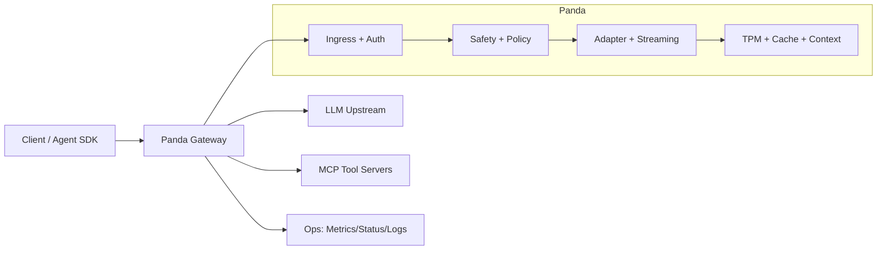

# Panda

Panda is a Rust AI gateway for agent-era traffic. It sits between your client and model providers, and adds policy, security, observability, MCP tool orchestration, and production-ready operations.

## What Panda Gives You

- OpenAI-compatible ingress for chat/streaming traffic.
- MCP host support with tool-call interception and multi-hop follow-up.
- Policy and safety controls (JWT, prompt safety, PII scrubbing, proof-of-intent).
- Semantic cache and optional context enrichment.
- Operational endpoints (`/health`, `/ready`, `/metrics`, `/mcp/status`, `/tpm/status`).
- Kubernetes-friendly behavior (readiness gates, graceful drain on shutdown).

## Architecture (High Level)



## QuickStart

### 1) Local (Cargo)

1. Copy example config:
   - `cp panda.example.yaml panda.yaml`
2. Set your upstream in `panda.yaml`:
   - `upstream: "http://127.0.0.1:11434"` (or your provider endpoint)
3. Start Panda:
   - `cargo run -p panda-server -- panda.yaml`
4. Health check:
   - `curl -s http://127.0.0.1:8080/health`

Minimal chat test:

```bash
curl -s http://127.0.0.1:8080/v1/chat/completions \
  -H "Content-Type: application/json" \
  -d '{
    "model":"gpt-4o-mini",
    "messages":[{"role":"user","content":"hello from panda"}]
  }'
```

Optional structured logs:

- `RUST_LOG=info cargo run -p panda-server -- panda.yaml`
- Optional OTLP export:
  - `OTEL_EXPORTER_OTLP_ENDPOINT=http://127.0.0.1:4318/v1/traces`
  - `PANDA_OTEL_SERVICE_NAME=panda-gateway`
  - When set, the gateway also exports OpenTelemetry **trace spans** to that endpoint (HTTP/protobuf); structured JSON logs still go to stdout.
- Semantic cache backend override (when `semantic_cache.enabled=true`):
  - `PANDA_SEMANTIC_CACHE_REDIS_URL=redis://127.0.0.1:6379`
  - `semantic_cache.backend: "redis"` in `panda.yaml` (Redis-compatible; Dragonfly works too)

### 2) Docker

Build and run:

```bash
docker build -t panda:latest .
docker run --rm -p 8080:8080 \
  -v "$(pwd)/panda.yaml:/app/panda.yaml:ro" \
  panda:latest /app/panda.yaml
```

By default, the Docker build enables `mimalloc` (`PANDA_BUILD_FEATURES=mimalloc`).

### 3) Kubernetes

Starter manifests are in `k8s/`:

- `configmap.yaml`
- `deployment.yaml`
- `service.yaml`
- `pdb.yaml`
- `hpa.yaml`
- `secret.example.yaml`

Deploy:

```bash
kubectl apply -f k8s/configmap.yaml
kubectl apply -f k8s/secret.example.yaml
kubectl apply -f k8s/deployment.yaml
kubectl apply -f k8s/service.yaml
kubectl apply -f k8s/pdb.yaml
kubectl apply -f k8s/hpa.yaml
```

Rollback:

```bash
kubectl rollout undo deployment/panda
kubectl rollout status deployment/panda
```

## Runtime Behavior (Production)

- `/health` reports process liveness.
- `/ready` reports real readiness (config/runtime checks) and turns not-ready during shutdown drain.
- On `SIGTERM`/`SIGINT`, Panda stops accepting new work and drains active connections up to `PANDA_SHUTDOWN_DRAIN_SECONDS` (default `30`).

## Validation and Performance Scripts

- Pre-rollout gate:
  - `PANDA_BASE_URL=http://127.0.0.1:8080 ./scripts/staging_readiness_gate.sh`
- Load profile:
  - `PANDA_BASE_URL=http://127.0.0.1:8080 LOAD_PAYLOAD=./payload.json LOAD_REQUESTS=500 LOAD_CONCURRENCY=50 ./scripts/load_profile_chat.sh`
- SSE soak guard:
  - `PANDA_BASE_URL=http://127.0.0.1:8080 SOAK_PAYLOAD=./payload_stream.json SOAK_DURATION_SECONDS=3600 SOAK_CONCURRENCY=10 SOAK_PID=<panda_pid> SOAK_MAX_FAILURES=0 ./scripts/soak_guard_sse.sh`
- OTLP smoke test (self-contained local upstream + local OTLP receiver):
  - `./scripts/otlp_smoke.sh`

All script outputs are written to `artifacts/` (git-ignored).

## Release Packaging (Reproducible Path)

- Reproducible release build (locked dependencies + `SOURCE_DATE_EPOCH`):
  - `./scripts/release_repro_build.sh`
- Optional target override:
  - `PANDA_RELEASE_TARGET=x86_64-unknown-linux-gnu ./scripts/release_repro_build.sh`
- Optional feature override:
  - `PANDA_RELEASE_FEATURES="mimalloc" ./scripts/release_repro_build.sh`

## Optional Allocator Tuning

For long-lived streaming workloads, `mimalloc` is enabled by default in Docker/release scripts; compare behavior manually with:

```bash
cargo build -p panda-server --release --features mimalloc
```

Enable only after load/soak evidence in your environment.

## Wasm Plugin Runtime Notes

- Panda uses warm Wasm instances (pool) per plugin; set `PANDA_WASM_INSTANCE_POOL_SIZE` (default `4`).
- Current guest ABI is v1 (`panda_abi_version() == 1`) with optional hooks:
  - `panda_on_request`
  - `panda_on_request_body`
  - `panda_on_response_chunk` (streaming chunk hook)
- Rust plugin authors should use `crates/panda-pdk`; TinyGo sample parity lives in `samples/tinygo-plugin/`.

## Documentation Map

- Implementation roadmap: `docs/implementation_plan.md`
- High-level architecture: `docs/high_level_design.md`
- Integration strategy: `docs/integration_and_evolution.md`
