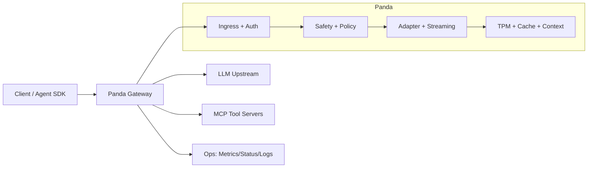

# Panda

Panda is a Rust AI gateway for agent-era traffic. It sits between your client and model providers, and adds policy, security, observability, MCP tool orchestration, and production-ready operations.

Traditional gateways optimize the **network envelope** (TLS, routing, who opened the TCP connection). Panda is aimed at the **semantic data plane**: what the AI workload is doing—tokens, tools, cache hits, and safety around prompts and bodies—so an OpenAI-shaped API can run like an enterprise service.

## Why Panda? (unified vision)

Panda is built around one idea: **treat AI traffic as a first-class operational domain**, not as “yet another HTTP microservice behind the same edge.”

- **One surface for humans and agents** — Clients keep using an **OpenAI-compatible** API while Panda handles identity, budgets, safety, and tool orchestration in one place.
- **Semantic + financial + security together** — Token budgets, semantic cache, prompt/PII policy, Wasm plugins, and MCP tool loops share the same request context, so you can reason about *cost, risk, and behavior* without bolting on five sidecars.
- **Stream-native and stateless by default** — Long-lived SSE streams, graceful handling of slow or stuck model workers, and horizontal scale without a bespoke session cluster.
- **Plays well with the edge you already have** — Run standalone or **alongside Kong** (or similar): the edge keeps TLS and coarse routing; Panda specializes the AI paths with a clear trust model for identity headers.
- **Extensible without forking the binary** — **Wasm** for custom guards, **MCP** for tools, **GitOps YAML** for config—so platform teams can evolve policy faster than upstream gateway releases.

In short: Panda is the **unified AI gateway layer**—one place to observe “what the model and tools are doing,” enforce policy, and keep operators in control as agents become normal production traffic.

## Four layers (what Panda adds on top of “just proxying”)

| Layer | Role in Panda |
|-------|----------------|
| **Financial control** | TPM-style token budgets, semantic cache to cut repeat spend, ops endpoints for budget visibility. |
| **Security & privacy** | JWT / JWKS and identity rules, prompt-safety and PII controls, Wasm plugins for extra policy (e.g. body guards). |
| **Agentic intelligence** | MCP host: intercept tool calls, route to your servers, optional proof-of-intent and streaming tool loops. |
| **Performance & ops** | Rust + rustls, long-lived **SSE** streaming, `/health` / `/ready`, metrics, optional OTLP traces, graceful drain. |

Details and limits of each feature live in `docs/` and `panda.example.yaml`; treat the table as a map, not a guarantee of every edge case.

## Where Panda sits (with or without Kong)

- **Behind Kong (coexistence)** — Kong stays on the public edge (TLS, OAuth, WAF, thousand legacy routes). You route AI paths (e.g. `/v1/chat/*`) to Panda as a specialized hop. Panda adds TPM, MCP, cache, and AI-centric policy **without** migrating everything off Kong. Identity from the edge can flow in via the trusted-gateway / “Kong handshake” model (`docs/kong_handshake.md`, `docs/deployment.md`).
- **Standalone (unified edge)** — Panda terminates TLS and fronts both model providers and your own HTTP services from one `panda.yaml` (no Kong DB; GitOps-friendly config). JWT/JWKS, routes, and AI features live in one place (`docs/deployment.md#standalone-no-kong`, `docs/integration_and_evolution.md`).
- **With third-party observability** — Wire OTLP (and existing metrics/log patterns) into your stack (Prometheus, Jaeger, Honeycomb, etc.); see `docs/deployment.md` and the QuickStart env vars for OTLP.

**Rule of thumb:** smaller teams often start **standalone** for simplicity; larger orgs often keep **Kong at the edge** and use Panda for AI paths first.

**Design highlights:** Memory-safe Rust (including TLS via rustls); **Wasm** plugins for custom request/body/stream checks without rebuilding the gateway; **MCP** as a first-class tool path; **OpenAI-shaped ingress** with an adapter layer for other providers (see config and `docs/high_level_design.md`).

## What Panda Gives You

- OpenAI-compatible ingress for chat/streaming traffic.
- MCP host support with tool-call interception and multi-hop follow-up.
- Policy and safety controls (JWT, prompt safety, PII scrubbing, proof-of-intent).
- Semantic cache and optional context enrichment.
- Operational endpoints (`/health`, `/ready`, `/metrics`, `/mcp/status`, `/tpm/status`).
- Kubernetes-friendly behavior (readiness gates, graceful drain on shutdown).

## Architecture (High Level)



## QuickStart

### 1) Local (Cargo)

1. Copy example config:
   - `cp panda.example.yaml panda.yaml`
2. Set your upstream in `panda.yaml`:
   - `upstream: "http://127.0.0.1:11434"` (or your provider endpoint)
3. Start Panda:
   - `cargo run -p panda-server -- panda.yaml`
4. Health check:
   - `curl -s http://127.0.0.1:8080/health`

Minimal chat test:

```bash
curl -s http://127.0.0.1:8080/v1/chat/completions \
  -H "Content-Type: application/json" \
  -d '{
    "model":"gpt-4o-mini",
    "messages":[{"role":"user","content":"hello from panda"}]
  }'
```

Optional structured logs:

- `RUST_LOG=info cargo run -p panda-server -- panda.yaml`
- Optional OTLP export:
  - `OTEL_EXPORTER_OTLP_ENDPOINT=http://127.0.0.1:4318/v1/traces`
  - `PANDA_OTEL_SERVICE_NAME=panda-gateway`
  - `PANDA_OTEL_TRACE_SAMPLING_RATIO=0.2` (0.0 to 1.0, parent-based ratio sampler)
  - When set, the gateway also exports OpenTelemetry **trace spans** to that endpoint (HTTP/protobuf); structured JSON logs still go to stdout.
- Upstream streaming timeouts (see **Slow upstreams and streaming** below):
  - `PANDA_UPSTREAM_FIRST_BYTE_TIMEOUT_MS` (default 90000; `0` disables)
  - `PANDA_UPSTREAM_SSE_IDLE_TIMEOUT_MS` (default 120000 for SSE inter-chunk idle; `0` disables)
- Semantic cache backend override (when `semantic_cache.enabled=true`):
  - `PANDA_SEMANTIC_CACHE_REDIS_URL=redis://127.0.0.1:6379`
  - `semantic_cache.backend: "redis"` in `panda.yaml` (Redis-compatible; Dragonfly works too)
  - `PANDA_SEMANTIC_CACHE_TIMEOUT_MS=50` (cache bypass timeout budget)
- Developer Console event stream (disabled by default):
  - `PANDA_DEV_CONSOLE_ENABLED=true`
  - UI: `GET /console` (minimal live timeline; connects to the WebSocket below)
  - WebSocket: `GET /console/ws` (same listener as proxy; JSON events: request lifecycle + `mcp_call` with `payload.phase` `start`/`finish`)
  - When `observability.admin_secret_env` is set (same as `/metrics`), `/console` and `/console/ws` require the `observability.admin_auth_header` secret; without that env, the console is open to anyone who can reach the listen address (use only on trusted networks or bind to loopback).

### 2) Docker

Build and run:

```bash
docker build -t panda:latest .
docker run --rm -p 8080:8080 \
  -v "$(pwd)/panda.yaml:/app/panda.yaml:ro" \
  panda:latest /app/panda.yaml
```

By default, the Docker build enables `mimalloc` (`PANDA_BUILD_FEATURES=mimalloc`).

**MCP + Postgres lab (Compose):** `deploy/mcp-starters/` builds an image with Node/npm so `npx @modelcontextprotocol/*` servers can run as stdio children. From the repo root: `docker compose -f deploy/mcp-starters/docker-compose.yml up --build` (see `deploy/mcp-starters/README.md`).

**Community Wasm plugins:** examples and contribution notes live in [`community-plugins/README.md`](community-plugins/README.md).

### 3) Kubernetes

Starter manifests are in `k8s/`:

- `configmap.yaml`
- `deployment.yaml`
- `service.yaml`
- `pdb.yaml`
- `hpa.yaml`
- `secret.example.yaml`

Deploy:

```bash
kubectl apply -f k8s/configmap.yaml
kubectl apply -f k8s/secret.example.yaml
kubectl apply -f k8s/deployment.yaml
kubectl apply -f k8s/service.yaml
kubectl apply -f k8s/pdb.yaml
kubectl apply -f k8s/hpa.yaml
```

Rollback:

```bash
kubectl rollout undo deployment/panda
kubectl rollout status deployment/panda
```

## Runtime Behavior (Production)

- `/health` reports process liveness.
- `/ready` reports real readiness (config/runtime checks) and turns not-ready during shutdown drain.
- On `SIGTERM`/`SIGINT`, Panda stops accepting new work and drains active connections up to `PANDA_SHUTDOWN_DRAIN_SECONDS` (default `30`).

### Slow upstreams and streaming (“slow-think” guard)

Async model workers sometimes **accept the TCP connection** and return `200` with `text/event-stream`, then stall before sending meaningful chunks—tying up clients and load balancers.

Panda applies two timeouts on the upstream response body:

| Guard | Env var | Default | Meaning |
|-------|---------|---------|--------|
| **First byte** | `PANDA_UPSTREAM_FIRST_BYTE_TIMEOUT_MS` | `90000` (90s); `0` disables | After response headers, fail if **no body bytes** arrive in time. |
| **Between chunks (SSE)** | `PANDA_UPSTREAM_SSE_IDLE_TIMEOUT_MS` | `120000` (120s); `0` disables | After the **first** body chunk on SSE responses, fail if the upstream stays idle **before the next chunk** for this long—catches hung streams after they started. |

Non-SSE responses only use the first-byte wrapper (plus the overall upstream request timeout for the initial round-trip).

## Developer Console

The Developer Console is an optional live debug surface for request flow and MCP tool activity.

### Enable It

1. Start Panda with:
   - `PANDA_DEV_CONSOLE_ENABLED=true cargo run -p panda-server -- panda.yaml`
2. Open:
   - UI: `http://127.0.0.1:8080/console`
   - Event stream: `ws://127.0.0.1:8080/console/ws`

### Protect It (Recommended)

Use the same auth model as ops endpoints:

1. In `panda.yaml`, set:
   - `observability.admin_secret_env: PANDA_OPS_SECRET`
2. Export a secret:
   - `export PANDA_OPS_SECRET='change-me'`
3. Send the header name from config (default is `x-panda-admin-secret`):
   - `x-panda-admin-secret: <secret>`

When `observability.admin_secret_env` is set, both `/console` and `/console/ws` require this secret.

### What You See

- **Live Trace** UI (`/console`): pick a request in the sidebar, then read the **timeline** (lifecycle + MCP) and the **thought stream** (throttled excerpts from streaming assistant `delta.content` when SSE is proxied).
- Event kinds on the wire:
  - `request_started` / `request_finished` / `request_failed`
  - `mcp_call` with `payload.phase` `start` / `finish` (round, server, tool, redacted args, duration)
  - `llm_trace` with `payload.text_tail` and `chars_total` (developer console only; sampled ~every 400ms during SSE)
- Core fields: `request_id`, `ts_unix_ms`, `stage`, `kind`, `method`, `route`, `status`, `elapsed_ms`.

### Quick Verify

- Console page reachable:
  - `curl -i http://127.0.0.1:8080/console`
- WebSocket handshake:
  - `curl -i -N -H "Connection: Upgrade" -H "Upgrade: websocket" -H "Sec-WebSocket-Version: 13" -H "Sec-WebSocket-Key: SGVsbG8sIHdvcmxkIQ==" http://127.0.0.1:8080/console/ws`
- Trigger traffic:
  - `curl -s http://127.0.0.1:8080/v1/chat/completions -H "Content-Type: application/json" -d '{"model":"gpt-4o-mini","messages":[{"role":"user","content":"hello"}]}'`

### Notes

- Disabled by default; when disabled, `/console` and `/console/ws` return `404`.
- Event fanout uses a bounded channel. Slow viewers may skip old events under load (stream stays connected).
- Redaction is best-effort for sensitive MCP argument keys; do not expose the console on untrusted networks.

## Validation and Performance Scripts

- Pre-rollout gate:
  - `PANDA_BASE_URL=http://127.0.0.1:8080 ./scripts/staging_readiness_gate.sh`
- Load profile:
  - `PANDA_BASE_URL=http://127.0.0.1:8080 LOAD_PAYLOAD=./payload.json LOAD_REQUESTS=500 LOAD_CONCURRENCY=50 ./scripts/load_profile_chat.sh`
- SSE soak guard:
  - `PANDA_BASE_URL=http://127.0.0.1:8080 SOAK_PAYLOAD=./payload_stream.json SOAK_DURATION_SECONDS=3600 SOAK_CONCURRENCY=10 SOAK_PID=<panda_pid> SOAK_MAX_FAILURES=0 ./scripts/soak_guard_sse.sh`
- OTLP smoke test (self-contained local upstream + local OTLP receiver):
  - `./scripts/otlp_smoke.sh`
- TPM Redis failover soak:
  - `./scripts/tpm_redis_failover_soak.sh`

All script outputs are written to `artifacts/` (git-ignored).

## Release Packaging (Reproducible Path)

- Reproducible release build (locked dependencies + `SOURCE_DATE_EPOCH`):
  - `./scripts/release_repro_build.sh`
- Optional target override:
  - `PANDA_RELEASE_TARGET=x86_64-unknown-linux-gnu ./scripts/release_repro_build.sh`
- Optional feature override:
  - `PANDA_RELEASE_FEATURES="mimalloc" ./scripts/release_repro_build.sh`

## Optional Allocator Tuning

For long-lived streaming workloads, `mimalloc` is enabled by default in Docker/release scripts; compare behavior manually with:

```bash
cargo build -p panda-server --release --features mimalloc
```

Enable only after load/soak evidence in your environment.

## Wasm Plugin Runtime Notes

- Panda uses warm Wasm instances (pool) per plugin; set `PANDA_WASM_INSTANCE_POOL_SIZE` (default `4`).
- Current guest ABI is v1 (`panda_abi_version() == 1`) with optional hooks:
  - `panda_on_request`
  - `panda_on_request_body`
  - `panda_on_response_chunk` (streaming chunk hook)
- Rust plugin authors should use `crates/panda-pdk`.
- **Minimal samples**: `crates/wasm-plugin-sample` (Rust), `examples/tinygo-plugin/` (TinyGo).
- **Useful examples**:
  - **Rust** — `crates/wasm-plugin-ssrf-guard`: block private URLs / dangerous schemes in request bodies (SSRF-style guard).
  - **TinyGo** — `examples/tinygo-plugin-pci-guard`: block bodies with long runs of ASCII digits (PAN-style paste guard).

## Documentation Map

- **Deployment** (binary, config, Redis / Prometheus / OTLP / Kong): `docs/deployment.md`
- Implementation roadmap: `docs/implementation_plan.md`
- High-level architecture: `docs/high_level_design.md`
- Integration strategy: `docs/integration_and_evolution.md`
- Kong / Panda evolution (phases 1–3): `docs/evolution_phases.md`
- Standalone (no Kong) — see `docs/deployment.md#standalone-no-kong` (legacy: `docs/standalone_deployment.md`)
- Kong / edge handshake (trusted headers): `docs/kong_handshake.md`
- Developer Console usage: `docs/developer_console.md`
