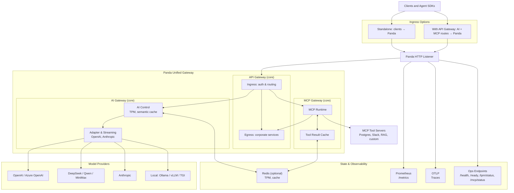
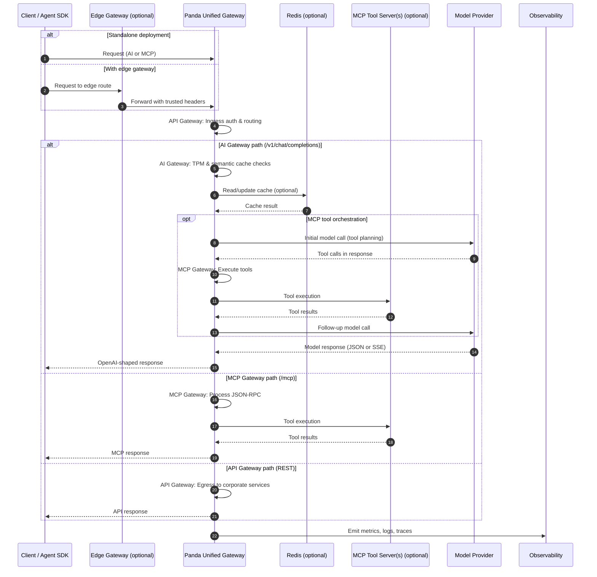

# Panda


**Website:** https://www.homeclaw.cn/panda/

**Panda is a Rust unified gateway**: combines **API gateway** capabilities with **MCP (Model Context Protocol) tool orchestration** and **AI gateway** features—all in one binary with one **YAML** config. It is built for **streaming**, **token-aware budgets**, **agent-ready tool loops**, and **low-cardinality observability** so you get clear **key values** (who, what, cost, cache, tools) without turning the gateway into a data warehouse.

### Key values (what you get)

| Value | How Panda delivers it |
|-------|------------------------|
| **Easy adoption** | Clients keep `/v1/chat/completions` and familiar JSON; swap `upstream` in `panda.yaml`. |
| **Cost & fairness** | TPM-style **token budgets**, optional **semantic cache**, **`GET /tpm/status`** for this replica’s view of a caller’s window. |
| **Agent-ready** | **MCP host** (stdio / SSE-style servers), multi-round tool loops, optional tool-result cache + metrics. |
| **Operable at scale** | **`/metrics`** stays **low-cardinality**; use **logs / optional compliance JSONL** + correlation id to join detail; **`GET /ops/fleet/status`** for a one-page snapshot; **`GET /ready`** documents model-failover streaming behavior. |
| **Fast path** | **Rust + rustls**, stream-first proxying, **SSE timeouts** (slow upstreams don’t hang clients forever). |
| **Governance hooks** | JWT/JWKS, prompt safety, PII scrub, **Wasm** plugins; optional **signed audit JSONL** ([`docs/compliance_export.md`](docs/compliance_export.md)). |

**Enterprise (opt-in):** hierarchical budgets (Redis), **model failover** / parity chains, console SSO—[`docs/enterprise_track.md`](docs/enterprise_track.md). Buffered mid-stream SSE failover trades **time-to-first-token** for resilience when enabled; see **`/ready`** → `model_failover.streaming_failover`.

---

## What is Panda?

A **unified gateway** that combines three powerful functions in one binary:

1. **API Gateway** — Ingress routing, egress governance, TLS, auth, rate limits
2. **MCP (Model Context Protocol) Gateway** — Tool orchestration, tool result caching, multi-round agent loops
3. **AI Gateway** — OpenAI-compatible chat endpoints, token budgets, semantic cache, model adapters

You run **`cargo run -p panda-server -- panda.yaml`** (or Docker/K8s). **Client** traffic stays **OpenAI-compatible** on AI paths, while **MCP tool calls** use JSON-RPC over HTTP. **Upstream** targets include OpenAI-compatible bases (Ollama, vLLM, many clouds), **Anthropic-native** APIs via the built-in adapter, and **REST/remote MCP tool servers**.

---

## Use Cases

Panda can be used in various configurations depending on your needs:

| Use Case | Description | Configuration |
|----------|-------------|---------------|
| **Pure API Gateway** | Traditional REST API proxying with path routing, auth, and rate limits | `mcp.enabled: false`, configure `routes` and `api_gateway` |
| **AI Gateway Only** | Governed OpenAI-compatible proxy with token budgeting and semantic cache | `mcp.enabled: false`, set `default_backend` or `routes` |
| **MCP Gateway Only** | Tool orchestration for integration tests, scripts, or headless automation | `mcp.enabled: true`, configure `mcp.servers` |
| **AI Gateway + MCP** | Assistant flows where the LLM chooses tools and Panda executes them | `mcp.enabled: true`, set `mcp_advertise_tools: true` on routes |
| **Full Stack** | Enterprise deployment with all components: API gateway, MCP, and AI gateway | All components enabled and configured |

Detailed use case examples with configuration: [`docs/panda_use_cases.md`](docs/panda_use_cases.md)

---

## Inbound vs Outbound (Architecture)

| Pillar | Role | Typical Stack |
|--------|------|----------------|
| **Inbound** | **API Gateway** (ingress/egress) + **MCP Gateway** for tool orchestration | Clients → Panda API Gateway → Panda MCP → Corporate API Gateway → REST |
| **Outbound** | **AI Gateway** for LLM traffic | Clients → Panda → Model Providers (OpenAI, Anthropic, local) |

Cross-cutting identity, policy, and observability apply to both. **First step:** start with **[Phase 1 MCP + API gateway](docs/mcp_gateway_phase1.md)** (defer advanced MCP options until basics work). Full architecture: [`docs/architecture_two_pillars.md`](docs/architecture_two_pillars.md).

---

## QuickStart

Choose the QuickStart that matches your use case:

### Option 1: AI Gateway (Standalone)

The fastest path to get started with LLM traffic.

#### Prerequisites
- [Rust toolchain](https://rustup.rs/) (stable), **or** Docker
- A model server URL: e.g. [Ollama](https://ollama.com/) on `http://127.0.0.1:11434`, or a cloud provider’s OpenAI-compatible base URL

#### 1. Config
```bash
cp panda.example.yaml panda.yaml
```

Edit `panda.yaml`:
- Set **`default_backend`** to your provider (examples):
  - Local Ollama: `http://127.0.0.1:11434`
  - OpenAI: `https://api.openai.com/v1` (set `Authorization` / API key via env or route config)
- Default **`listen`** is `127.0.0.1:8080`

#### 2. Run
```bash
cargo run -p panda-server -- panda.yaml
```

#### 3. Verify
```bash
# Health check
curl -s http://127.0.0.1:8080/health

# Test chat completion
curl -s http://127.0.0.1:8080/v1/chat/completions \
  -H "Content-Type: application/json" \
  -d '{
    "model": "gpt-4o-mini",
    "messages": [{"role": "user", "content": "hello from Panda"}]
  }'
```

### Option 2: MCP Gateway (Tool Orchestration)

For tool orchestration without LLM traffic.

#### 1. Config
Edit `panda.yaml`:
```yaml
mcp:
  enabled: true
  servers:
    - name: corpapi
      enabled: true
      http_tool:
        path: /api/data
        method: GET
        tool_name: fetch
api_gateway:
  ingress:
    enabled: true
    routes:
      - path_prefix: /mcp
        backend: mcp
        methods: [POST]
  egress:
    enabled: true
    corporate:
      default_base: http://internal-api:8080
    allowlist:
      allow_hosts: [internal-api:8080]
      allow_path_prefixes: [/api]
```

#### 2. Run
```bash
cargo run -p panda-server -- panda.yaml
```

#### 3. Verify
```bash
# Test MCP initialization
curl -s http://127.0.0.1:8080/mcp \
  -H "Content-Type: application/json" \
  -d '{
    "jsonrpc": "2.0",
    "id": 1,
    "method": "initialize",
    "params": {
      "protocolVersion": "2025-03-26",
      "capabilities": {},
      "clientInfo": {
        "name": "test",
        "version": "0"
      }
    }
  }'
```

### Option 3: Full Stack (API + MCP + AI)

For complete agent workflows with tool integration.

#### 1. Config
Edit `panda.yaml` to enable all components:
- Set `default_backend` for AI traffic
- Enable `mcp` with tool servers
- Configure `api_gateway` for ingress/egress

#### 2. Run
```bash
cargo run -p panda-server -- panda.yaml
```

#### 3. Verify
- Test AI gateway: `/v1/chat/completions`
- Test MCP: `/mcp` JSON-RPC
- Test API gateway: path-based routing

**Tip:** Enable the [Developer Console](docs/developer_console.md) for live debugging:
```bash
PANDA_DEV_CONSOLE_ENABLED=true cargo run -p panda-server -- panda.yaml
```

---

## Deployment Options

| Deployment | What to Use |
|------------|-------------|
| **Local Development** | `cargo run` + `panda.yaml`; optional `PANDA_DEV_CONSOLE_ENABLED=true` for [`/console`](docs/developer_console.md) |
| **Docker Container** | `docker build` + mount `panda.yaml`; fully supports all three gateway functions |
| **Kubernetes** | Manifests under `k8s/`; updated ConfigMap with unified gateway configuration |
| **Behind Edge Gateway** | Edge handles TLS and coarse routing; forward AI, MCP, and API paths to Panda—see [`docs/kong_handshake.md`](docs/kong_handshake.md) |
| **MCP + Databases** | `deploy/mcp-starters/docker-compose.yml` — see `deploy/mcp-starters/README.md` |
| **Load Testing** | `scripts/staging_readiness_gate.sh`, `scripts/load_profile_chat.sh` |

### Environment Overrides (Common)
- `PANDA_LISTEN_OVERRIDE=0.0.0.0:8080` — override YAML `listen` (e.g. bind all interfaces)
- `OTEL_EXPORTER_OTLP_ENDPOINT=...` — enable OTLP trace export (see full list in [`crates/panda-server/src/main.rs`](crates/panda-server/src/main.rs) `ENV_HELP`)
- `PANDA_GRPC_HEALTH_LISTEN=0.0.0.0:50051` — gRPC **`grpc.health.v1`** (requires binary built with **`--features grpc`**)
- `PANDA_DEV_CONSOLE_ENABLED=true` — enable developer console
- `PANDA_UPSTREAM_FIRST_BYTE_TIMEOUT_MS` — timeout for first upstream response byte
- `PANDA_UPSTREAM_SSE_IDLE_TIMEOUT_MS` — timeout for SSE chunk idle time

---

## Design Principles

- **Unified Gateway** — Three powerful functions in one binary: **API Gateway** (ingress/egress), **MCP Gateway** (tool orchestration), and **AI Gateway** (LLM traffic).
- **One Hop Policy** — Identity, budgets, cache, MCP, and safety see the same request; config stays in **YAML** (`panda.example.yaml` is the annotated template).
- **Stream-Native** — SSE stays incremental where possible; optional **buffered mid-stream failover** (enterprise) is explicit in **`/ready`** because it affects **TTFT**.
- **Observability Focus** — Prometheus stays **healthy** with low-cardinality metrics; **correlation id**, **`/tpm/status`**, and optional **audit JSONL** carry detailed information.
- **Flexible Deployment** — Use as standalone AI gateway, pure API gateway, MCP gateway, or full-stack solution. **Edge + Panda** pattern supported with trusted hop contracts.

**Core vs Enterprise:** core = single `panda.yaml`, optional Redis for TPM/cache, no SSO required. Enterprise = console SSO, hierarchical budgets, model failover chains—[`docs/enterprise_track.md`](docs/enterprise_track.md).

---

## Architecture (high level)



**Legend:** **(core)** means usable with default small-team `panda.yaml` without Enterprise-only blocks. **Enterprise** items are opt-in (`console_oidc`, `budget_hierarchy`, `model_failover`, etc.); see [`docs/enterprise_track.md`](docs/enterprise_track.md).

### Sequence data flow (request lifecycle)



---

## Docker

Build and run:

```bash
docker build -t panda:latest .
docker run --rm -p 8080:8080 \
  -v "$(pwd)/panda.yaml:/app/panda.yaml:ro" \
  panda:latest /app/panda.yaml
```

Container images default `PANDA_LISTEN_OVERRIDE=0.0.0.0:8080` so host port publishing works out of the box.

**Unified Gateway Support:** The Docker image now fully supports all three gateway functions (API, MCP, and AI) with the updated configuration format.

**Build Features:** By default, the Docker build enables `mimalloc` (`PANDA_BUILD_FEATURES=mimalloc`).

**MCP + Postgres lab:** `docker compose -f deploy/mcp-starters/docker-compose.yml up --build` (see `deploy/mcp-starters/README.md`).

**Community Wasm plugins:** [`community-plugins/README.md`](community-plugins/README.md).

---

## Kubernetes

Starter manifests: `k8s/configmap.yaml`, `deployment.yaml`, `service.yaml`, `pdb.yaml`, `hpa.yaml`, `secret.example.yaml`.

### Unified Gateway Configuration

The Kubernetes `configmap.yaml` has been updated to support the unified gateway architecture:

- Uses `default_backend` instead of the legacy `upstream` field
- Includes **API Gateway** configuration with ingress/egress routes
- Includes **MCP Gateway** configuration with sample tool servers

### Deployment Steps

1. **Update the configmap** with your actual upstream and MCP tool servers:
   - Set `default_backend` to your LLM provider
   - Configure `api_gateway` routes as needed
   - Add MCP tool servers under `mcp.servers`

2. **Apply the manifests**:

```bash
kubectl apply -f k8s/configmap.yaml
kubectl apply -f k8s/secret.example.yaml
kubectl apply -f k8s/deployment.yaml
kubectl apply -f k8s/service.yaml
kubectl apply -f k8s/pdb.yaml
kubectl apply -f k8s/hpa.yaml
```

Rollback: `kubectl rollout undo deployment/panda`

---

## Runtime behavior (production)

- `/health` — liveness.
- `/ready` — readiness JSON (fails during drain); includes **`model_failover.streaming_failover`** notes when failover is configured (e.g. buffered SSE tradeoffs).
- **`GET /ops/fleet/status`** — single JSON snapshot: TPM hints, MCP tool-cache counters, semantic-cache counters, Prometheus series hints (operators).
- **`GET /compliance/status`** — audit export config (same admin auth pattern as `/metrics` when configured).
- **Shutdown** — `SIGTERM`/`SIGINT`; drains up to `PANDA_SHUTDOWN_DRAIN_SECONDS` (default `30`). Optional **gRPC health** (`panda-server` with **`--features grpc`**, env **`PANDA_GRPC_HEALTH_LISTEN`**) stops when the HTTP gateway exits.

### Slow upstreams and streaming (“slow-think” guard)

| Guard | Env var | Default | Meaning |
|-------|---------|---------|--------|
| **First byte** | `PANDA_UPSTREAM_FIRST_BYTE_TIMEOUT_MS` | `90000` (90s); `0` disables | After response headers, fail if **no body bytes** arrive in time. |
| **Between chunks (SSE)** | `PANDA_UPSTREAM_SSE_IDLE_TIMEOUT_MS` | `120000` (120s); `0` disables | After the **first** chunk on SSE, fail if idle **before the next chunk** for this long. |

Non-SSE responses use the first-byte guard plus the overall upstream request timeout.

---

## Developer Console

Optional live debug UI for request flow and MCP activity.

1. `PANDA_DEV_CONSOLE_ENABLED=true cargo run -p panda-server -- panda.yaml`
2. Open `http://127.0.0.1:8080/console` and `ws://127.0.0.1:8080/console/ws`

Protect with `observability.admin_secret_env` + `observability.admin_auth_header` (same pattern as `/metrics`). Full details: [`docs/developer_console.md`](docs/developer_console.md).

---

## QuickStart extras (optional env vars)

- **Logs:** `RUST_LOG=info cargo run -p panda-server -- panda.yaml` (compliance JSONL append failures log **`tracing::warn`** throttled when export is on—see [`docs/compliance_export.md`](docs/compliance_export.md)).
- **OTLP:** `OTEL_EXPORTER_OTLP_ENDPOINT=http://127.0.0.1:4318/v1/traces`, `PANDA_OTEL_SERVICE_NAME=panda-gateway`, `PANDA_OTEL_TRACE_SAMPLING_RATIO=0.2`
- **Streaming timeouts:** `PANDA_UPSTREAM_FIRST_BYTE_TIMEOUT_MS`, `PANDA_UPSTREAM_SSE_IDLE_TIMEOUT_MS`
- **Semantic cache (Redis):** `PANDA_SEMANTIC_CACHE_REDIS_URL`, `semantic_cache.backend: "redis"`, `PANDA_SEMANTIC_CACHE_TIMEOUT_MS`
- **gRPC health (LB probes):** build with `cargo build -p panda-server --features grpc`, set **`PANDA_GRPC_HEALTH_LISTEN=0.0.0.0:50051`** ([`docs/grpc_ingress_roadmap.md`](docs/grpc_ingress_roadmap.md)).
- **Console:** `PANDA_DEV_CONSOLE_ENABLED=true` — when `observability.admin_secret_env` is set, `/console` requires the admin header; without it, do not expose on untrusted networks.

---

## Validation and performance scripts

- `PANDA_BASE_URL=http://127.0.0.1:8080 ./scripts/staging_readiness_gate.sh`
- Auth-protected status checks: `READINESS_AUTH_HEADER='x-panda-admin-secret: <secret>' PANDA_BASE_URL=http://127.0.0.1:8080 ./scripts/staging_readiness_gate.sh`
- `PANDA_BASE_URL=http://127.0.0.1:8080 LOAD_PAYLOAD=./payload.json LOAD_REQUESTS=500 LOAD_CONCURRENCY=50 ./scripts/load_profile_chat.sh`
- SSE soak: `PANDA_BASE_URL=... SOAK_PAYLOAD=./payload_stream.json ... ./scripts/soak_guard_sse.sh`
- OTLP smoke: `./scripts/otlp_smoke.sh`
- TPM Redis failover soak: `./scripts/tpm_redis_failover_soak.sh`

Outputs go to `artifacts/` (git-ignored).

---

## Release packaging

- `./scripts/release_repro_build.sh`
- Optional: `PANDA_RELEASE_TARGET=x86_64-unknown-linux-gnu`, `PANDA_RELEASE_FEATURES="mimalloc"`

## Optional allocator tuning

```bash
cargo build -p panda-server --release --features mimalloc
```

## Wasm plugin runtime

- Pool: `PANDA_WASM_INSTANCE_POOL_SIZE` (default `4`).
- Guest ABI v1: `panda_on_request`, `panda_on_request_body`, `panda_on_response_chunk`.
- PDK: `crates/panda-pdk`; samples: `crates/wasm-plugin-sample`, `examples/tinygo-plugin/`, `crates/wasm-plugin-ssrf-guard`, `examples/tinygo-plugin-pci-guard`.

---

## Documentation Map

| Doc | Topic |
|-----|--------|
| [`docs/panda_use_cases.md`](docs/panda_use_cases.md) | Use cases and configuration examples for all deployment scenarios |
| [`docs/architecture_two_pillars.md`](docs/architecture_two_pillars.md) | Inbound (MCP + API gateway) vs outbound (AI gateway) — module & config map |
| [`docs/mcp_gateway_phase1.md`](docs/mcp_gateway_phase1.md) | Phase 1: what the API gateway vs Panda MCP own; minimal YAML; what to defer |
| [`docs/mcp_gateway_reference_designs.md`](docs/mcp_gateway_reference_designs.md) | Design notes: [Docker](https://github.com/docker/mcp-gateway) & [Microsoft](https://github.com/microsoft/mcp-gateway) MCP gateways vs Panda |
| [`docs/design_mcp_control_plane_rust.md`](docs/design_mcp_control_plane_rust.md) | Target design: Rust MCP gateway + API gateway, control plane vs data plane, phased evolution |
| [`docs/panda_data_flow.md`](docs/panda_data_flow.md) | Canonical data-flow patterns (API gateway in front / behind / combined) |
| [`docs/design_api_gateway_and_mcp_gateway.md`](docs/design_api_gateway_and_mcp_gateway.md) | Detailed design: ingress/egress pipelines, MCP execution model, modules, YAML shape |
| [`docs/implementation_plan_mcp_api_gateway.md`](docs/implementation_plan_mcp_api_gateway.md) | Phased implementation plan: Panda MCP + Panda API gateway |
| [`docs/panda_api_gateway_features.md`](docs/panda_api_gateway_features.md) | Feature catalog: what Panda’s API gateway provides (and what it doesn’t) |
| [`docs/protocol_evolution.md`](docs/protocol_evolution.md) | MCP, A2A-style protocols, adapters, future capability registry |
| [`docs/deployment.md`](docs/deployment.md) | Binary, config, Redis, Prometheus, OTLP, edge placement |
| [`docs/kong_handshake.md`](docs/kong_handshake.md) | Trusted L7 hop → Panda (attested headers; any gateway) |
| [`docs/panda_vs_kong_positioning.md`](docs/panda_vs_kong_positioning.md) | Optional: edge vs AI-plane split (legacy filename) |
| [`docs/openclaw_agent_quickstart.md`](docs/openclaw_agent_quickstart.md) | Agent fleets: metrics, MCP cache, failover hints |
| [`docs/tool_cache_mvp.md`](docs/tool_cache_mvp.md) | MCP tool-result cache + compliance matrix |
| [`docs/runbooks/agent_fleet_oncall.md`](docs/runbooks/agent_fleet_oncall.md) | On-call: PromQL → logs/compliance → `/tpm/status` |
| [`docs/ai_routing_strategy.md`](docs/ai_routing_strategy.md) | Semantic routing, agent sessions, profiles |
| [`docs/mcp_failover_streaming.md`](docs/mcp_failover_streaming.md) | Why MCP streaming skips buffered mid-stream failover |
| [`docs/grpc_ingress_roadmap.md`](docs/grpc_ingress_roadmap.md) | Optional gRPC health listener |
| [`docs/high_level_design.md`](docs/high_level_design.md) | Architecture |
| [`docs/integration_and_evolution.md`](docs/integration_and_evolution.md) | Coexistence with other systems |
| [`docs/evolution_phases.md`](docs/evolution_phases.md) | Rollout phases (edge + gateway) |
| [`docs/enterprise_track.md`](docs/enterprise_track.md) | Enterprise features |
| [`docs/developer_console.md`](docs/developer_console.md) | Developer console |
| [`docs/compliance_export.md`](docs/compliance_export.md) | Compliance / audit JSONL |
| [`docs/wasm_abi.md`](docs/wasm_abi.md) | Wasm guest ABI |
| [`docs/dependency_audit.md`](docs/dependency_audit.md) | Dependency notes |
| [`docs/implementation_plan.md`](docs/implementation_plan.md) | Roadmap |

### SDKs, plugins, and examples

| Resource | Topic |
|----------|-------|
| [`crates/panda-pdk/rust/README.md`](crates/panda-pdk/rust/README.md) | Rust PDK usage |
| [`crates/panda-pdk/go/README.md`](crates/panda-pdk/go/README.md) | Go PDK usage |
| [`community-plugins/README.md`](community-plugins/README.md) | Community plugin catalog |
| [`crates/wasm-plugin-ssrf-guard/README.md`](crates/wasm-plugin-ssrf-guard/README.md) | Production-minded Wasm plugin example |
| [`examples/README.md`](examples/README.md) | End-to-end examples |
| [`examples/mcp_stdio_minimal/README.md`](examples/mcp_stdio_minimal/README.md) | Minimal MCP stdio server example |
| [`examples/tinygo-plugin/README.md`](examples/tinygo-plugin/README.md) | TinyGo plugin example |
| [`examples/tinygo-plugin-pci-guard/README.md`](examples/tinygo-plugin-pci-guard/README.md) | TinyGo PCI guard example |

### MCP and integrations

| Resource | Topic |
|----------|-------|
| [`panda-mcp-registry/README.md`](panda-mcp-registry/README.md) | MCP server registry index |
| [`deploy/mcp-starters/README.md`](deploy/mcp-starters/README.md) | Docker Compose MCP starter stack (includes Postgres flow) |
| [`panda-mcp-registry/postgres/README.md`](panda-mcp-registry/postgres/README.md) | Postgres MCP integration |
| [`panda-mcp-registry/local-rag-lite/README.md`](panda-mcp-registry/local-rag-lite/README.md) | Local RAG MCP example |
