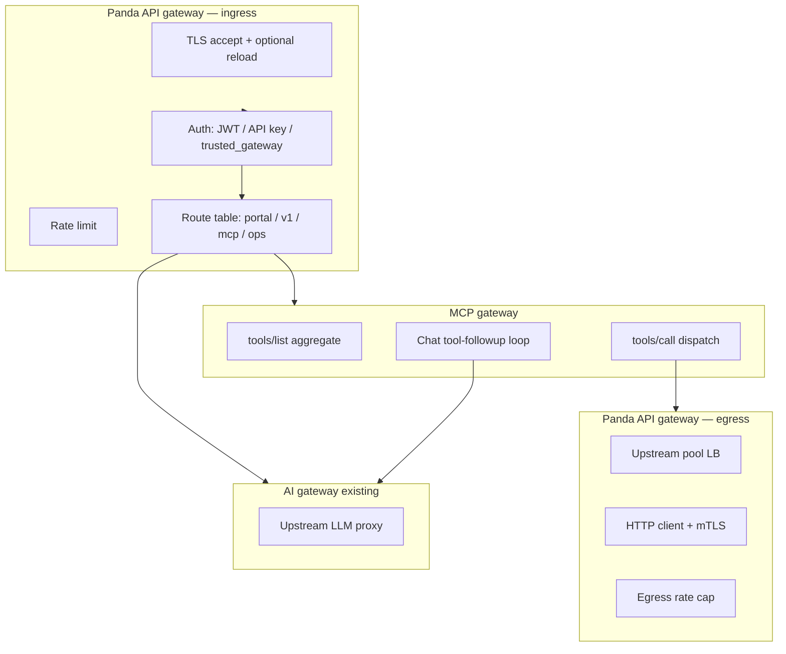

# Detailed design: Panda API gateway + MCP gateway

**Status:** Engineering design — **target** vs **shipped** is summarized in [`gateway_design_completion.md`](./gateway_design_completion.md) (this file keeps the full pipeline picture).  
**Flows:** [`panda_data_flow.md`](./panda_data_flow.md)  
**Features:** [`panda_api_gateway_features.md`](./panda_api_gateway_features.md)  
**Phased delivery:** [`implementation_plan_mcp_api_gateway.md`](./implementation_plan_mcp_api_gateway.md)  
**Control plane (separate track):** [`design_mcp_control_plane_rust.md`](./design_mcp_control_plane_rust.md)

This document **narrows** how the **MCP gateway** and **Panda API gateway** behave internally, how they connect, and what configuration and extension points look like—without duplicating the full control-plane SQL design.

---

## 1. Scope and boundaries

| Component | In scope here | Out of scope here |
|-----------|----------------|-------------------|
| **MCP gateway** | Tool discovery, stdio (and future streamable HTTP) transports, OpenAI tool naming, tool-call execution, rounds, integration with **egress** for HTTP tools | Full control-plane CRUD UI; SQL metadata store (see control-plane doc) |
| **API gateway** | Ingress pipeline, egress client, LB pools, rate limits, TLS management hooks, portal **integration** | Portal UI implementation detail (see `developer_console.md`); billing calculation engines |

**Single process:** Both gateways run inside **`panda-server`** / **`panda-proxy`** unless a future split is explicitly decided.

---

## 2. Logical architecture



**Traffic rules:**

- **Chat with tools:** Ingress → auth → **`/v1/chat/completions`** handler → MCP **`list_all_tools` / `call_tool`** inside loop → optional **egress** for HTTP-backed tools → upstream LLM.
- **Native MCP (HTTP transport):** Ingress → route **`/mcp`…** → MCP JSON-RPC / streamable HTTP handler (same `McpRuntime` underneath) — **config + router ready; handler returns 501 until implemented** (see [`gateway_design_completion.md`](./gateway_design_completion.md)).
- **Portal:** Ingress → static/OpenAPI routes → no MCP unless documenting tools.

---

## 3. MCP gateway — detailed design

### 3.1 Responsibilities

1. **Register** MCP server backends (stdio; declarative **`http_tool`** via egress; streamable HTTP **client** to remote MCP servers still **design-only**).
2. **Aggregate** `tools/list` across servers into a single list with stable **`server` + `tool`** identity.
3. **Map** aggregated tools to **OpenAI `tools[]`** / function names via `mcp_openai` (`mcp_{server}_{tool}` convention).
4. **Execute** `tools/call` with **timeout**, **payload bounds**, routing to the correct `McpClient` implementation.
5. **Enforce** global and per-request **round limits** (`max_tool_rounds`, session caps) in `lib.rs` orchestration.
6. **Optional:** `tool_routes`, `intent_tool_policies` (chat path), `tool_cache`, `hitl`. **`tool_routes`**, **`tool_cache`**, and **`hitl`** apply to **ingress MCP HTTP** `tools/call` as well as chat follow-up; see [`mcp_gateway_phase1.md`](./mcp_gateway_phase1.md) and [`tool_cache_mvp.md`](./tool_cache_mvp.md).

### 3.2 Existing code anchors

| Piece | Location | Role |
|-------|-----------|------|
| **`McpRuntime`** | `inbound/mcp.rs` | Holds `HashMap` of `Arc<dyn McpClient>`; `list_all_tools`, `call_tool`. |
| **`McpClient` trait** | `inbound/mcp.rs` | `list_tools`, `call_tool`. |
| **`StdioMcpClient`** | `inbound/mcp_stdio.rs` | JSON-RPC over stdio. |
| **Declarative REST tools** | `inbound/mcp_http_tool.rs` | `http_tool` / `http_tools` → `api_gateway::egress::EgressClient`. |
| **OpenAI mapping** | `inbound/mcp_openai.rs` | Function names, sanitization, tools JSON. |
| **Orchestration** | `lib.rs` | Chat path, stream probe, rounds, brain hooks. |
| **Egress client** | `api_gateway/egress.rs` | Allowlist, headers, profiles, retries, metrics. |
| **Ingress router** | `api_gateway/ingress.rs` | Prefix → `ApiGatewayIngressBackend`; **`mcp`** → `mcp_http_ingress` (see [`gateway_design_completion.md`](./gateway_design_completion.md)). |

### 3.3 Tool execution types (target)

| Type | Transport | Implementation note |
|------|-----------|---------------------|
| **Stdio MCP** | Subprocess | Current **`StdioMcpClient`**. |
| **Remote MCP (HTTP POST JSON-RPC)** | Network | **`McpHttpRemoteClient`** (`inbound/mcp_http_remote.rs`); **`remote_mcp_url`** in YAML; uses **egress** + allowlist. **SSE / streamable** client not implemented yet. |
| **HTTP tool (REST)** | Corporate REST | **Shipped:** not MCP protocol — `mcp_http_tool` → **`EgressClient`** → JSON tool result. |

**Design rule:** **MCP protocol** stays in `inbound/`; **generic HTTP outbound** for REST tools lives under **`api_gateway::egress`** and is **invoked** from MCP orchestration by tool kind.

### 3.4 MCP configuration model (today → extension)

Existing **`McpConfig`** (`panda-config`): `enabled`, `servers[]` (`name`, `command`, `args`, `enabled`), `fail_open`, `tool_timeout_ms`, `max_tool_payload_bytes`, `max_tool_rounds`, `advertise_tools`, advanced blocks.

**Extensions (design):**

```yaml
mcp:
  servers:
    - name: corp_api
      enabled: true
      # Kind: stdio | http_mcp | (omit = stdio or stub)
      # transport:
      #   kind: http_mcp
      #   url: https://mcp.internal.example/mcp
      # http_tool:  # declarative REST tool — uses API gateway egress
      #   egress_profile: internal_rest
      #   base_path: /v1/inventory
```

Exact YAML is **illustrative**; validation must reject ambiguous combinations.

### 3.5 Errors and `fail_open`

- **Timeout / transport error:** If `mcp.fail_open`, return **stable** user-visible tool content string (existing constants); else propagate error to client.
- **Unknown server/tool:** 4xx-class to model path; metrics **`panda_mcp_tool_errors_total`** (bounded reason label).

### 3.6 Observability (MCP)

- **`GET /mcp/status`** — runtime summary (existing); extend with **egress** health when HTTP tools exist.
- **Metrics:** tool calls, latency, cache hits (if enabled), stream probe events — **low cardinality** (`server` name from config enum, not dynamic paths).

---

## 4. Panda API gateway — detailed design

### 4.1 Ingress — ordered pipeline

For each accepted connection, **after** TLS handshake:

| Step | Name | Behavior |
|------|------|----------|
| 1 | **Parse** | Method, path, headers, optional body size hint. |
| 2 | **Correlation** | Allocate or forward `x-request-id` / `traceparent`. |
| 3 | **Rate limit** | **Target:** key = `(route_id, …)` + optional **Redis**. **Today:** separate global **`route_rps`** config — not the full per-ingress-route model. |
| 4 | **Route** | Longest **`path_prefix`** → `ApiGatewayIngressBackend` (`ai`, `ops`, `mcp`, `deny`, `gone`, `not_found`). No **`portal`** kind yet. |
| 5 | **Auth** | **Target:** per-route JWT / API key. **Today:** existing **`identity` / `auth` / `trusted_gateway`** on the main listener apply after ingress classification. |
| 6 | **Dispatch** | **`ai`** / **`ops`** / tombstones / **`deny`** → existing handlers; **`mcp`** → JSON-RPC over **POST** (`inbound/mcp_http_ingress.rs`). |

**TLS management:**

- Load **`cert_pem` / `key_pem`** at start; optional **`watch_interval_secs`** or **SIGHUP** to **reload** certs without full process restart (platform-dependent; document Linux/K8s signal).
- Config: **`min_tls_version`**, **`cipher_list`** (optional explicit allowlist).

**Load balancing (ingress):**

- **Across Panda replicas:** **External** LB / K8s Service (operational pattern); optionally **sticky sessions** if MCP HTTP needs affinity—document in runbook.
- **Inside Panda:** No “ingress LB to multiple backends” unless we add internal fan-out later; **egress** LB is the primary LB story.

### 4.2 Egress — components

| Component | Responsibility |
|-----------|------------------|
| **`EgressClient`** | `request(EgressRequest) -> Result<EgressResponse>`; owns **Hyper** pool. |
| **`UpstreamPool`** | Ordered list of base URLs + **strategy** (`round_robin`, `random`, `least_pending`); **atomic cursor** or lock-free index for RR. |
| **`Allowlist`** | Allowed **host + port + path prefix**; deny otherwise (**SSRF**). |
| **`EgressRateLimiter`** | Optional per-**profile** concurrency semaphore or RPS limiter. |
| **`TlsIdentity`** | Client cert + CA bundle for mTLS to corporate gateway. |

**Request flow:** MCP (or adapter) builds **`EgressRequest`** { profile, method, path, headers, body } → **allowlist** check → **rate cap** acquire → **pick upstream** from pool → **send** → **response size cap** → return.

### 4.3 Configuration schema (target, unified)

```yaml
api_gateway:
  ingress:
    enabled: true
    rate_limit:
      default_rps: 1000
      burst: 2000
      redis_url: null   # optional: shared across replicas
    routes:
      - path_prefix: /portal
        backend: portal
      - path_prefix: /v1
        backend: openai
      - path_prefix: /mcp
        backend: mcp_http
  egress:
    enabled: true
    profiles:
      internal_rest:
        allow_hosts: ["api.internal.example.com"]
        allow_https_only: true
        pools:
          - urls:
              - https://api.internal.example.com:443
              - https://api-secondary.internal.example.com:443
            strategy: round_robin
        timeout_ms: 30000
        rate_limit:
          max_in_flight: 64
    tls:
      client_cert_pem: /path/optional.pem
      client_key_pem: /path/optional-key.pem
      ca_pem: /path/corp-ca.pem
  tls:
    reload_on_signal: SIGHUP
    min_version: "1.2"
```

Validation rules: **no empty allow_hosts** when egress enabled; **HTTPS only** default for corporate profiles.

### 4.4 Developer portal (**one** surface — shipped baseline)

- **Today:** **`GET /portal`**, **`/portal/openapi.json`**, **`/portal/tools.json`** under the main listener (ops/auth as configured)—**one** place to discover **current** HTTP and MCP tool surfaces without a separate portal product.
- **Future optional:** dedicated ingress **`backend: portal`** row or deeper merge with **`/console`** if routing clarity needs it; not required for the baseline.
- **Read-only** tool list: JSON aligned with configured/runtime MCP tools (non-sensitive metadata).
- **OpenAPI:** static export for **public/admin** routes Panda exposes today.
- **API keys:** optional backlog (**Phase H3**); until then reuse **admin secret** / **`identity`** patterns ([`implementation_plan_mcp_api_gateway.md`](./implementation_plan_mcp_api_gateway.md) Phase **H**).

---

## 5. Shared request context

Fields propagated **ingress → MCP → egress → logs/metrics** (subset already exists as `RequestContext`):

| Field | Use |
|-------|-----|
| **correlation_id** | Logs, egress `x-request-id` to corporate API. |
| **subject / tenant / scopes** | Rate limit keys, audit, TPM buckets. |
| **route_id** | Metrics label (bounded enum). |
| **api_key_id** | Optional; portal-issued key id (hash in logs). |

---

## 6. Module layout (target)

```
crates/panda-proxy/src/
  api_gateway/
    mod.rs
    ingress.rs      # pipeline, route table, rate limit integration
    egress.rs       # EgressClient, pools, allowlist
    tls_reload.rs   # optional small module for cert watch
  inbound/
    mcp.rs
    mcp_stdio.rs
    mcp_openai.rs
    mcp_http_tool.rs   # declarative REST tools → egress (shipped)
    mcp_http_remote.rs # remote MCP JSON-RPC client → egress (shipped)
    mcp_http_ingress.rs # MCP JSON-RPC server for ingress backend: mcp (shipped)
    # future: streamable MCP over SSE client/server
  shared/           # existing gateway.rs, tls.rs, ...
  lib.rs            # compose Service stack
```

**`panda-config`:** `ApiGatewayConfig`, `EgressProfileConfig`, `IngressRateLimitConfig`, nested under `PandaConfig`.

---

## 7. Alignment with implementation phases

| Design area | Phase (see implementation plan) |
|-------------|-----------------------------------|
| Config stubs | A |
| Egress client + allowlist | B (**done**); **pools** → G1 (**open**) |
| Ingress route + rate limit | C (**done**); design **Redis RL** → G2 (**open**) |
| MCP → egress for HTTP tools | D (**http_tool done**; ingress **`mcp`** JSON-RPC **shipped** — `tools/call` shares `tool_routes`, `tool_cache`, `hitl` with chat) |
| TLS reload + policy | G4 |
| Portal routes + OpenAPI | H |

---

## 8. Open questions

1. **Split listen** for admin vs public on same host vs port split — security review.
2. **MCP HTTP transport:** one endpoint per server vs multiplexed — affects route table.
3. **Redis** for rate limits: key TTL vs sliding window algorithm choice.
4. **Portal auth:** separate cookie domain vs API key only for v1.

---

## Related docs

- [`mcp_gateway_phase1.md`](./mcp_gateway_phase1.md)  
- [`kong_handshake.md`](./kong_handshake.md)  
- [`developer_console.md`](./developer_console.md)  
