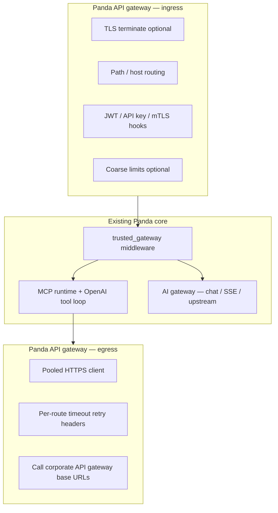

# Implementation plan: Panda MCP gateway + Panda API gateway

**Status:** Detailed design + phased execution plan.  
**Implementation vs design (kept current):** [`gateway_design_completion.md`](./gateway_design_completion.md)  
**Canonical flows:** [`panda_data_flow.md`](./panda_data_flow.md)  
**Target architecture:** [`design_mcp_control_plane_rust.md`](./design_mcp_control_plane_rust.md)  
**Phase 1 MCP scope (today’s YAML):** [`mcp_gateway_phase1.md`](./mcp_gateway_phase1.md)  
**Feature catalog (ingress / egress):** [`panda_api_gateway_features.md`](./panda_api_gateway_features.md)  
**Detailed design (API + MCP gateway internals):** [`design_api_gateway_and_mcp_gateway.md`](./design_api_gateway_and_mcp_gateway.md)

---

## 1. Objectives

| Goal | Success criteria |
|------|------------------|
| **All-in-one** | One `panda-server` binary can expose **Panda API gateway (ingress)** and/or **(egress)** together with **MCP** and existing **AI gateway** paths. |
| **Placement** | **Ingress:** HTTP into MCP + chat with TLS, routing, auth hooks. **Egress:** MCP/tool-initiated HTTP to **corporate** API gateway URLs with consistent headers, timeouts, retries policy. |
| **Compatibility** | Existing `panda.yaml` (`mcp`, `trusted_gateway`, `tls`, `listen`) keeps working; new blocks are **additive** with safe defaults (off). |
| **Performance** | Ingress adds **bounded** overhead (async, no extra sync DB on hot path); egress reuses **pooled** HTTP client(s). |
| **Observability** | Metrics + structured logs for ingress decisions and egress calls (low-cardinality labels). |

### 1.1 Non-goals (this program)

- Replacing **full** marketplace / **billing engines** / Lua-scale plugin bazaars. A **single developer portal** (**`/portal`** + OpenAPI + tools JSON for **shipped** features) is **in scope**; **API keys** and similar are **optional** follow-ons ([`panda_api_gateway_features.md`](./panda_api_gateway_features.md)).
- Implementing the full **control-plane SQL stack** (Postgres/MySQL/SQLite admin API) in the **first** milestone — that follows in a **parallel track** ([`design_mcp_control_plane_rust.md`](./design_mcp_control_plane_rust.md) §2).
- **Full** MCP **streamable HTTP** (sessions, resumption, multi-chunk streams) may land in a **later** milestone — a **minimal** SSE/NDJSON envelope path exists today; schedule deeper work per team capacity.

---

## 2. Current baseline (repo reality)

**Summary:** Phases **A–C** and the bulk of **D** are implemented. See the matrix in [`gateway_design_completion.md`](./gateway_design_completion.md) for phase-by-phase detail.

- **MCP gateway:** `crates/panda-proxy/src/inbound/{mcp,mcp_stdio,mcp_openai,mcp_http_tool}.rs`; `McpConfig` in `panda-config`; wired in `lib.rs` (chat tool loop, `/mcp/status`, metrics).
- **API gateway — egress:** `crates/panda-proxy/src/api_gateway/egress.rs` — allowlisted HTTP to corporate bases; **`http_tool` / `http_tools`** use this path; optional **`egress.profiles`** and per-tool **`egress_profile`**; retries on **429 / 5xx** as configured.
- **API gateway — ingress:** `api_gateway/ingress.rs` + `dispatch` — prefix routing, **`ai`** (optional per-route **`upstream`**), **`ops`**, tombstones (**`gone`**, **`not_found`**), **`deny`**, **`mcp`** route kind serves **JSON-RPC 2.0 over POST** (and **minimal streamable HTTP**: SSE `data:` wrapping one JSON-RPC envelope when `Accept: text/event-stream` / `application/x-ndjson`). Stdio + chat-embedded MCP unchanged.
- **Edge trust / TLS:** `shared/gateway.rs`, `trusted_gateway`; `shared/tls.rs` on main `listen` (unchanged pattern).

**Remaining vs original “target” diagram:** Deeper **MCP streamable HTTP** (sessions / resumption), **ingress RL metrics labels**, **egress TLS cipher** tuning, **cluster-wide egress rate limits**, **optional** portal extras (e.g. self-service **API keys**, richer multi-version docs) — see phases **E–H** and §4 below. *(Per-ingress-route RPS + optional Redis, top-level route RPS + same Redis, and egress TLS min version / SIGHUP / PEM watch are shipped — **G2** / **G4**.)* **Phase H baseline:** one **`/portal`** surface for **existing** features is **in scope and largely shipped** (see §4 Phase **H**); we are **not** targeting a Kong-style full marketplace portal.

---

## 3. Detailed design

### 3.1 Component model



- **Ingress** is a **middleware chain** on the **same** Tokio/Hyper server (or a **dedicated listen** if config requests split — see §3.4).
- **Egress** is an **internal service** invoked when a tool (or future HTTP adapter) needs to call **configured** upstream REST endpoints **through** corporate gateway URLs.

### 3.2 Configuration (illustrative YAML)

New top-level block (names subject to bikeshed; **defaults = disabled**):

```yaml
# Target shape — not all keys exist in code until implemented.
api_gateway:
  ingress:
    enabled: false
    # If true: run ingress middleware before MCP + chat handlers.
    # listen: "0.0.0.0:8443"   # optional split listener; default = same as `listen`
    routes:
      - path_prefix: /mcp
        backend: mcp
      - path_prefix: /v1
        backend: ai
    # auth: ...                # optional: tie into identity/jwks
  egress:
    enabled: false
    # Default HTTP client limits for tool egress
    timeout_ms: 30000
    pool_idle_timeout_ms: 90000
    corporate:
      # Named upstreams tools may target (full URL to corporate API gateway entry)
      default_base: "https://api.internal.company.com"
      # Optional per-tool or per-route overrides via control plane / future registry
```

**Rules:**

- **`api_gateway.ingress.enabled: false`** → current behavior unchanged.
- **`api_gateway.egress.enabled: false`** → tools that today only use **stdio MCP** unchanged; HTTP-tool path gated until explicitly configured.

### 3.3 Ingress — behavior

1. **Order:** Parse request → **ingress** (if enabled) → existing **trusted_gateway** / identity → route to **MCP path** vs **OpenAI chat** vs **ops** (today’s logic).
2. **TLS:** Reuse **`tls`** block for the main listener; if **split listen** for ingress-only, duplicate TLS config pointer or inherit global `tls`.
3. **Routing:** `path_prefix` longest match → internal **dispatch enum** (`Mcp`, `Ai`, `Admin`, `Static403`) — align with existing path handling in `lib.rs` to avoid double prefix bugs.
4. **Auth:** Phase 1 of ingress can **delegate** to existing `identity` / `auth` for `/v1/*`; MCP paths may require **stricter** rules — document per route.

### 3.4 Egress — behavior

1. **Trigger:** MCP tool handler (or future **HTTP tool** adapter) calls **`EgressClient::request(EgressRequest)`** with:
   - method, path (relative to `corporate.default_base` or override),
   - headers (inject service identity, correlation id, `Authorization` from vault/env),
   - body, timeout override.
2. **Policy:** Global defaults from `api_gateway.egress`; per-adapter overrides from **control plane** (later) or static YAML.
3. **Safety:** Host allowlist / URL prefix allowlist to prevent SSRF from malicious tool configs — **required** before marking egress GA.
4. **Observability:** One histogram for latency, counters for `result=ok|4xx|5xx|timeout`, labels: `route` (bounded enum), not raw URL.

### 3.5 Module layout (proposed)

| Location | Responsibility |
|----------|----------------|
| `crates/panda-proxy/src/api_gateway/mod.rs` | Feature flags, re-exports |
| `api_gateway/ingress.rs` | Middleware: routing table, hooks |
| `api_gateway/egress.rs` | Pooled client, allowlist, request builder |
| `panda-config` | `ApiGatewayConfig` structs, validation (egress URL schemes, host allowlist) |
| `lib.rs` | Insert ingress chain; pass `Arc<EgressClient>` into MCP runtime when wired |

Alternative: nest under `shared/` if you prefer fewer top-level mods — choose one in **Milestone A** and keep consistent.

### 3.6 Security checklist (before GA)

- [x] Egress **SSRF** allowlist (**host + path prefix** required when egress enabled; CIDR not implemented).
- [ ] Secrets **never** logged; header redaction on debug traces (operational review).
- [x] Ingress **rate limits**: top-level **`routes[].rate_limit`**; **`api_gateway.ingress.routes[].rate_limit`**; optional **`api_gateway.ingress.rate_limit_redis`** (shared counters). **Open:** low-cardinality **metrics** labels per ingress row (design catalog).
- [x] **mTLS** egress to corporate gateway when required (`api_gateway.egress.tls` client cert + key + optional `extra_ca_pem`; integration test in `egress.rs`).

### 3.7 Testing strategy

| Layer | Tests |
|-------|--------|
| **panda-config** | Deserialize + reject invalid `api_gateway` combinations. |
| **Unit** | Ingress router longest-prefix; egress URL join + allowlist deny. |
| **Integration** | Hyper test server as “corporate gateway”; tool path issues egress GET; assert headers. |
| **Regression** | All existing `cargo test -p panda-proxy` with `api_gateway` absent (defaults). |

---

## 4. Phased implementation

Work in **vertical slices**; each phase is shippable behind config defaults.

**Status column (April 2026):** **Done** = matches `main` for the described slice; **Open** = not shipped or only partial — details in [`gateway_design_completion.md`](./gateway_design_completion.md).

### Phase A — Config + stubs (1–2 weeks, 1 engineer) — **Done**

| ID | Deliverable |
|----|-------------|
| **A1** | `ApiGatewayConfig` in `panda-config` with `ingress.enabled` / `egress.enabled` default `false`; validation tests. |
| **A2** | `api_gateway` module in `panda-proxy` with no-op ingress pass-through when disabled. |
| **A3** | Docs: this file + `panda.example.yaml` commented skeleton for `api_gateway`. |

**Exit:** `cargo test -p panda-config -p panda-proxy` green; no behavior change for users.

### Phase B — Egress client + allowlist (2–3 weeks) — **Done** (+ profiles, 429 retries)

| ID | Deliverable |
|----|-------------|
| **B1** | `EgressClient` wrapping Hyper/rustls; pool config from YAML. |
| **B2** | Host/path **allowlist**; deny with structured error + metric. |
| **B3** | Wire **one** internal call site (e.g. future “HTTP tool” or dev-only test hook) — if no product call site yet, feature-gated **integration test only** + `#[cfg(test)]` helper for MCP follow-up. |
| **B4** | Metrics: `panda_egress_requests_total`, `panda_egress_request_duration_ms_*`. |

**Exit:** Egress usable from tests; production path documented as “pending MCP HTTP tool binding” if stdio-only.

### Phase C — Ingress routing shell (2–3 weeks) — **Done** (+ per-route AI `upstream`, methods, deny/gone/not_found)

| ID | Deliverable |
|----|-------------|
| **C1** | Ingress middleware: `path_prefix` → internal route id **before** main handler. |
| **C2** | Align with `/mcp/*`, `/v1/*`, `/health`, `/metrics` — **no** duplicate handling. |
| **C3** | Optional **split listen** (if in scope); else document “same listener only” for this phase. |
| **C4** | Integration tests: wrong prefix → 404; correct → reaches existing handler. |

**Exit:** `api_gateway.ingress.enabled: true` with routes matches target routing table.

### Phase D — MCP integration (3–5 weeks, depends on B) — **Done** (streamable HTTP = later)

| ID | Deliverable |
|----|-------------|
| **D1** | Define how tools declare **HTTP** backend vs stdio (config or registry entry). |
| **D2** | `tools/call` path uses **EgressClient** for HTTP tools; stdio unchanged. |
| **D3** | Correlation id propagated **ingress → MCP → egress**. |
| **D4** | Update [`mcp_gateway_phase1.md`](./mcp_gateway_phase1.md) with egress-enabled Phase 1+ notes. |

**Exit:** End-to-end: agent → Panda (ingress optional) → MCP → egress → mock corp API.

**D5 — Ingress MCP HTTP (shipped):** `backend: mcp` routes handle **POST** JSON-RPC (`inbound/mcp_http_ingress.rs`). **Open:** MCP **streamable HTTP** (SSE) if required by specific clients.

### Phase E — Control plane linkage (parallel track) — **Open** (E0–E4 partial)

| ID | Deliverable |
|----|-------------|
| **E0** | Config `control_plane` + read-only **`GET …/v1/status`** + **`GET …/v1/api_gateway/ingress/routes`** (YAML snapshot; `observability.admin_secret_env` when set). |
| **E1** | **Ingress:** **`POST`** upsert + **`DELETE ?path_prefix=`**; **`classify_merged`** with static ingress. **`GET …/export`**, **`POST …/import`** with query **`mode=merge`** or **`mode=replace`**. Dynamic JSON/SQL rows may include **`rate_limit.rps`** (SQL column **`rate_limit_rps`** when using **`control-plane-sql`**). |
| **E2** | **`control_plane.store`:** `memory`, **`json_file`**, **`sqlite`**, **`postgres`**. **`postgres`** covers any PostgreSQL wire endpoint — **AWS RDS / Aurora PostgreSQL**, **Azure Database for PostgreSQL**, **GCP Cloud SQL for PostgreSQL** — via `database_url` (TLS in URL as required). No separate cloud-specific `kind`. **Not implemented:** MySQL (RDS/Aurora/Azure), **Azure SQL Database / SQL Server** (different protocol/dialect). SQL migrations in `panda-proxy/migrations/`. Feature **`control-plane-sql`** on `panda-proxy` (enabled by **`panda-server`**). |
| **E3** | **Cross-replica:** **`control_plane.reload_from_store_ms`** — periodic `load_all` → in-memory replace (works for **`json_file`**, **`sqlite`**, **`postgres`**). **`control_plane.store.postgres_listen: true`** — dedicated **`LISTEN panda_cp_ingress`**; writers run **`pg_notify`** after upsert/delete/replace (requires **`control-plane-sql`**). |
| **E4** | **Redis fan-out:** **`control_plane.reload_pubsub`** (`redis_url_env`, `channel`) — **`SUBSCRIBE`** on each replica; mutating control-plane HTTP handlers **`PUBLISH`** after store+memory update. **API-style secrets:** **`control_plane.additional_admin_secret_envs`** — same header as `observability.admin_auth_header` (see [`panda.example.yaml`](../panda.example.yaml)) may match any listed env **or** `admin_secret_env`. **External SQL** on Postgres still needs poll or optional DB trigger — see [`runbooks/control_plane_postgres_external_writes.md`](./runbooks/control_plane_postgres_external_writes.md). **Open:** row-level multi-tenant namespacing, OIDC roles for control plane, Redis-backed issuance/revocation UI. |

**Exit:** Documented in control-plane plan; not blocking Phase D for static YAML.

### Phase F — Hardening — **Partial** (SSRF baseline in B; **F1 shipped**)

| ID | Deliverable |
|----|-------------|
| **F1** | mTLS egress option; custom CA bundle. **Done:** `api_gateway.egress.tls` + `build_egress_http_client`; test **`integration_https_mtls_presents_client_cert_to_upstream`**. |
| **F2** | Load test ingress overhead; document SLO. |
| **F3** | Security review checklist §3.6 signed off. |

### Phase G — Load balancing, rate limits, TLS management — **Partial** (G1 + **G2** + **G3 basic** + **G4 TLS reload/min-version** shipped)

| ID | Deliverable |
|----|-------------|
| **G1** | **Egress upstream pools** in config (multiple base URLs + **round-robin** / weighted); metrics per slot. |
| **G2** | **Ingress rate limits**: **`api_gateway.ingress.routes[].rate_limit.rps`** (1s window); enforced after successful ingress classify for all backends (**429** + **`Retry-After`**). Top-level **`routes[].rate_limit`** unchanged but shares optional **`api_gateway.ingress.rate_limit_redis`** (`url_env`, `key_prefix`) for **Redis `INCR` + 1s TTL** when set. **Open:** Prometheus label cardinality for per-row RL as in [`panda_api_gateway_features.md`](./panda_api_gateway_features.md). |
| **G3** | **Egress rate caps** (concurrency or RPS per target) to protect corporate APIs. **Basic slice shipped:** **`api_gateway.egress.rate_limit`** — **`max_in_flight`** (fail-fast) + **`max_rps`** (process-local 1s window); **`panda_egress_requests_total{result="rate_limited"}`**; MCP **`http_tool`** maps **`RateLimited` → HTTP 429** in tool result. **Not shipped:** per-target / per-route egress caps, Redis-coordinated caps. |
| **G4** | **TLS management:** **`api_gateway.egress.tls.min_protocol_version`** (`tls12` \| `tls13`); Unix **`reload_on_sighup`** re-reads PEMs; **`watch_reload_ms`** polls PEM mtimes. **Not shipped:** explicit **cipher** suite configuration (rustls defaults apply). |

**Exit:** Feature catalog items for LB, rate limit, TLS management have a concrete config + code path.

### Phase H — Developer portal (**one** surface for shipped features) — **Partial (baseline done)**

**Intent:** Panda needs **a single, simple portal** that surfaces **what the binary already does** (HTTP API shape, MCP tools, pointers to status/console)—**not** a multi-product developer platform or full Kong-style marketplace.

| ID | Deliverable |
|----|-------------|
| **H1** | **Shipped:** **`GET /portal`** (operator HTML: live **`/portal/summary.json`** embed + quick links), **`/portal/summary.json`** (read-only instance snapshot: MCP, API gateway, control plane, flags—**no secrets**), **`/portal/openapi.json`**, **`/portal/tools.json`**. |
| **H2** | **Ongoing:** Keep that **one** portal accurate as features evolve (copy, curl examples, links to **`/console`**, **`/mcp/status`**, metrics/health, docs). Avoid maintaining a second parallel doc system. |
| **H3** | **Optional backlog:** **API key** issuance + revocation + ingress wiring — **only** if product explicitly needs it; **not** part of “portal complete” for Panda’s default scope. |

**Exit (for our scope):** Integrators can discover Panda’s **existing** HTTP and MCP surfaces via **`/portal`** without buying or building a separate portal product. **H3** and similar expansions are **explicit opt-in** backlog, not Phase H “completion.”

---

## 5. Dependencies & risks

| Risk | Mitigation |
|------|------------|
| **`lib.rs` complexity** | Keep ingress as **one** layered `Service` or explicit pre-match function; avoid copy-paste per path. |
| **SSRF** | Allowlist **mandatory** before HTTP tools in prod. |
| **Scope creep** | Defer streamable MCP server transport to explicit milestone after D. |
| **Config explosion** | Start minimal YAML; control plane adds dynamic config later. |

---

## 6. Documentation & comms

- Update [`implementation_plan.md`](./implementation_plan.md) with a pointer to **this** doc under MCP / Phase 4+ area.
- Keep [`panda_data_flow.md`](./panda_data_flow.md) as the **non-negotiable** flow reference; update only if code diverges.
- Release notes: phases **A–D** (core gateway), **G** (LB / rate / TLS mgmt), **H** (portal)—short notes per milestone ([`panda_api_gateway_features.md`](./panda_api_gateway_features.md)).

---

## Related docs

- [`gateway_design_completion.md`](./gateway_design_completion.md) — phase + feature matrix vs `main`  
- [`architecture_two_pillars.md`](./architecture_two_pillars.md)  
- [`kong_handshake.md`](./kong_handshake.md)  
- [`mcp_gateway_reference_designs.md`](./mcp_gateway_reference_designs.md)  
