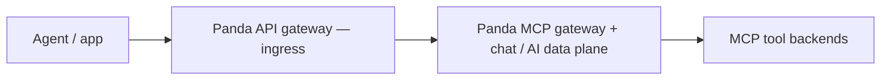
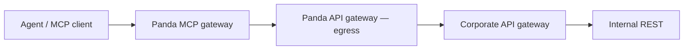

# Panda — data flow (keep in mind)

**Purpose:** Canonical **traffic shapes** for Panda’s **all-in-one** design: a **first-class Panda API gateway** that can sit **in front of** the MCP gateway (ingress) **or behind** it (egress toward the corporate API gateway and REST). External L7 (Kong, etc.) remains optional **outside** the whole product.

**See also:** [`panda_scenarios_summary.md`](./panda_scenarios_summary.md) (scenario matrix + top-down diagrams: MCP + API gateway + AI gateway), [`design_api_gateway_and_mcp_gateway.md`](./design_api_gateway_and_mcp_gateway.md) (detailed design), [`implementation_plan_mcp_api_gateway.md`](./implementation_plan_mcp_api_gateway.md) (build plan), [`design_mcp_control_plane_rust.md`](./design_mcp_control_plane_rust.md) §4, [`architecture_two_pillars.md`](./architecture_two_pillars.md), [`kong_handshake.md`](./kong_handshake.md) (when an **additional** edge gateway wraps Panda).

---

## All-in-one idea (one binary / one process)

| Panda API gateway role | Where it sits | Job |
|------------------------|---------------|-----|
| **Ingress (in front of MCP)** | Client → **Panda API GW** → **Panda MCP** | TLS, routing, auth, limits on the way **into** MCP + chat. |
| **Egress (behind MCP)** | **Panda MCP** → **Panda API GW** → **corporate API gateway** → REST | Uniform HTTP client path for tools: signing, routing, retries, identity toward **existing** corporate L7. |

Same **Panda API gateway** component, **two configurable positions** — not two different products. You can enable **ingress only**, **egress only**, or **both**.

Optional **external** Kong/NGINX in front of **everything** is still supported for enterprises that already standardize on it.

---

## Positioning: Panda as the REST-to-MCP bridge

This section states Panda’s **technical architecture** and **enterprise role** as implemented in the Rust codebase (not a separate “probabilistic brain” inside the proxy).

### 1. Architectural role (MCP terminology)

In strict **Model Context Protocol** vocabulary, Panda is **not** the **Host** (the end-user application such as an IDE or chat UI). In one process, Panda behaves as a **protocol gateway** with a **dual** role:

| Direction | Role toward peers | What the code does |
|-----------|-------------------|---------------------|
| **Ingress (northbound)** | **MCP server** toward callers | Unified HTTP surface (e.g. **`POST /mcp`**) speaking **JSON-RPC** (`initialize`, `tools/list`, `tools/call`). Callers see one tool catalog and session semantics. |
| **Egress (southbound)** | **MCP client(s)** toward backends | **`McpRuntime`** holds one internal client per configured `mcp.servers` entry: **stdio** subprocesses (**`StdioMcpClient`**), **remote MCP over HTTP** (**`McpHttpRemoteClient`** + **`remote_mcp_url`**), and **REST tools** (**`McpHttpToolClient`** + **`api_gateway.egress`**) for **`http_tool`** / **`http_tools`**. |

So: **JSON-RPC MCP on the front**; **stdio, remote MCP HTTP, or corporate REST** on the back—depending on YAML, not a single transport.

### 2. The “AI facade” (legacy REST without rewriting backends)

Panda’s practical value for migration is an **AI-shaped interface** over existing HTTP services: declarative mapping from **tool names** to **allowed** corporate URLs.

- **Declarative tooling:** **`http_tool`** (one tool per server block) or **`http_tools`** (several tools on one server). Paths join to **`api_gateway.egress.corporate.default_base`** (and **`allowlist`**). Ingress-visible names follow the OpenAI bridge: **`mcp_{server}_{tool}`** (e.g. `mcp_corpapi_fetch`).
- **Context injection:** On **`/v1/chat/completions`**, when MCP tools are advertised, Panda can **merge** tool definitions into the request so the **upstream LLM** sees a single list. **Tool selection in natural language is performed by that model**, not by Panda.
- **Execution loop:** When the upstream returns OpenAI-style **tool calls**, Panda’s **`McpRuntime`** resolves **server + tool**, runs the right client (including **REST via egress**), and appends **tool** messages for follow-up rounds.

Direct **`POST /mcp`** does **not** use an LLM: the **caller** supplies **`tools/call`** explicitly.

### 3. Deterministic security (intent gating)

Panda does **not** use a secondary LLM to “judge” tool calls. **Heuristic intent** (keyword buckets such as **`data_read`**, **`data_write`**, **`filesystem`**, **`general`**) plus **`mcp.intent_tool_policies`** and **`proof_of_intent_mode`** (`audit` / `enforce`) implement **deterministic** checks on the chat tool path. Details and keyword lists: **section 6** below.

### 4. Panda vs. traditional L7 API gateways (scope)

Traditional gateways optimize **stateless** request routing, auth, and rate limits. Panda adds a **first-class MCP and chat tool execution** path: **multi-round** tool loops, **MCP JSON-RPC** lifecycle on **`/mcp`**, and **egress-governed** calls to internal HTTP. Comparing to a specific product (e.g. Kong) is a **scope** discussion: many gateways can be extended with plugins; Panda is **MCP- and tool-loop-native** in one binary.

| Dimension | Typical L7 API gateway | Panda (this repo) |
|-----------|-------------------------|-------------------|
| **Primary unit** | HTTP request / route | MCP **tool** / JSON-RPC method; chat **tool calls** + optional LLM rounds |
| **Protocols** | REST, often gRPC/GraphQL via config | **MCP JSON-RPC** ingress; **OpenAI chat** to upstream; **stdio / remote MCP / REST** to backends |
| **Core loop** | Request in → route → response | **Tool discovery + execution**; chat path adds **upstream LLM** reasoning |
| **Safety (examples)** | WAF, rate limits, ACLs | **Egress allowlists**, **`mcp.tool_routes`**, **heuristic intent + `intent_tool_policies`**, optional **`pii`** on **buffered request bodies**, identity headers |

---

## 1. Ingress — Panda API gateway **in front of** MCP

---

## 2. Egress — Panda API gateway **behind** MCP (toward corporate L7)

---

## 3. Both roles on one path (typical “full” Panda stack)

Optional prefix: **Agent → external Kong →** … when the org puts Kong outside Panda.

---

## 4. Outbound AI (second pillar)

**OpenAI-shaped** traffic through Panda to **upstream LLMs** (`upstream`, routes, TPM, cache, failover) is the **AI gateway** pillar. It can share listeners and policy context with the paths above; diagram it separately when designing so LLM hops are not confused with corporate REST egress.

---

## 5. Ingress + MCP today

When **`api_gateway.ingress.enabled`** is true, prefix routing runs **before** the existing chat/MCP handlers. **`backend: ai`** and **`ops`** (and deny/tombstone backends) are fully dispatched. **`backend: mcp`** serves **MCP JSON-RPC 2.0 over HTTP POST** (e.g. builtin prefix `/mcp`): `initialize`, `tools/list`, `tools/call`, etc. Tool names match the OpenAI bridge (`mcp_{server}_{tool}`). Ingress **`tools/call`** shares **`mcp.tool_routes`**, **`mcp.tool_cache`**, and **`mcp.hitl`** with the chat MCP follow-up path (see [`tool_cache_mvp.md`](./tool_cache_mvp.md)). **MCP over OpenAI chat** (`/v1/...` with tools) and **stdio MCP servers** are unchanged. **Streamable HTTP** (SSE) for MCP is not implemented yet. See [`gateway_design_completion.md`](./gateway_design_completion.md).

---

## 6. MCP intent gating — **deterministic** (no “security LLM”)

Panda does **not** embed an LLM to approve or reject tool calls. **Tool choice** on chat is still made by the **upstream model** when tools are advertised; Panda applies **policy** using fixed rules.

### 6.1 Two traffic shapes (who decides the tool)

| Path | Who picks the tool | Panda’s role |
|------|--------------------|--------------|
| **`/v1/chat/completions`** with MCP tools injected | **Upstream LLM** returns OpenAI-style tool calls | Inject merged tool definitions, execute **`McpRuntime`** calls, optional follow-up rounds to the model |
| **`POST /mcp`** (ingress MCP JSON-RPC) | **Caller** sends `tools/call` with `params.name` | Protocol gateway: map `mcp_{server}_{tool}` → backend, no model involved |

### 6.2 Intent label (heuristic bucket)

For **OpenAI chat** requests when MCP tools are advertised, Panda derives a single **intent string** from the **last user message** in the JSON body using **`classify_intent_from_chat_request`** in [`crates/panda-proxy/src/inbound/mcp.rs`](../crates/panda-proxy/src/inbound/mcp.rs).

- Input: raw POST body bytes; parses `messages`, takes the **last** message with **`role: user`**, uses **`content`** as a lowercase string (non-string content is not used).
- Method: **keyword counts** — each listed substring match scores **+1** in one of three groups (**write**, **read**, **filesystem**). No ML, no embeddings.

**Write terms (summed → `write` score):**  
`write`, `delete`, `update`, `create`, `insert`, `drop`, `remove`, `modify`

**Read terms (summed → `read` score):**  
`read`, `list`, `show`, `query`, `search`, `find`, `fetch`, `select`

**Filesystem terms (summed → `fs` score):**  
`file`, `directory`, `path`, `folder`, `open`, `save`, `rename`, `filesystem`

**Bucket selection (first match in order):**

1. If `fs >= write` **and** `fs >= read` **and** `fs > 0` → intent **`filesystem`**
2. Else if `write > read` **and** `write > 0` → **`data_write`**
3. Else if `read > 0` → **`data_read`**
4. Else → **`general`**

If the body is not valid JSON or has no usable user string, intent is **`general`**.

### 6.3 Policy mapping (`intent_tool_policies`)

YAML **`mcp.intent_tool_policies`** lists, per **`intent`**, which tools are **allowed** (OpenAI function name `mcp_server_tool` or canonical `server.tool`). Empty policies → no intent filtering.

- **Advertise time:** `filter_tools_for_intent` can **drop** tools from the list injected into chat so the model never sees disallowed names.
- **Call time:** When the upstream returns a tool call, **`tool_allowed_for_intent`** checks the call against the same policies. If **`mcp.proof_of_intent_mode`** is **`enforce`**, a mismatch **blocks** the call (deterministic error path); **`audit`** logs only. Implementation: MCP follow-up loop in [`crates/panda-proxy/src/lib.rs`](../crates/panda-proxy/src/lib.rs) (search `proof_of_intent_mode`).

### 6.4 Why document this

Intent gating is **auditable**: keywords and YAML lists are reviewable. It adds **predictable** latency (string scan + table lookup), not an extra round trip to a model.

---

## 7. Checklist for new work

- [ ] Does this feature belong to **Panda API gateway (ingress)**, **(egress)**, **MCP**, or **AI gateway**?
- [ ] If **external** Kong wraps Panda, is **`trusted_gateway`** documented for identity headers?
- [ ] Egress path: does it assume **Panda API gateway → corporate API gateway**, or direct HTTP (both may need config knobs)?
