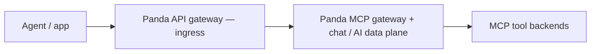
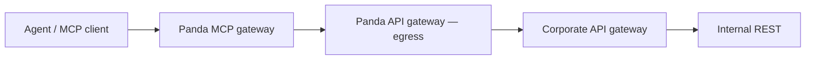
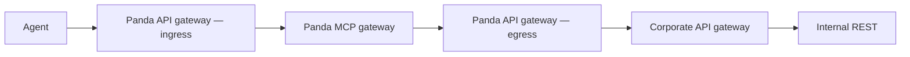

# Panda — data flow (keep in mind)

**Purpose:** Canonical **traffic shapes** for Panda’s **all-in-one** design: a **first-class Panda API gateway** that can sit **in front of** the MCP gateway (ingress) **or behind** it (egress toward the corporate API gateway and REST). External L7 (Kong, etc.) remains optional **outside** the whole product.

**See also:** [`design_api_gateway_and_mcp_gateway.md`](./design_api_gateway_and_mcp_gateway.md) (detailed design), [`implementation_plan_mcp_api_gateway.md`](./implementation_plan_mcp_api_gateway.md) (build plan), [`design_mcp_control_plane_rust.md`](./design_mcp_control_plane_rust.md) §4, [`architecture_two_pillars.md`](./architecture_two_pillars.md), [`kong_handshake.md`](./kong_handshake.md) (when an **additional** edge gateway wraps Panda).

---

## All-in-one idea (one binary / one process)

| Panda API gateway role | Where it sits | Job |
|------------------------|---------------|-----|
| **Ingress (in front of MCP)** | Client → **Panda API GW** → **Panda MCP** | TLS, routing, auth, limits on the way **into** MCP + chat. |
| **Egress (behind MCP)** | **Panda MCP** → **Panda API GW** → **corporate API gateway** → REST | Uniform HTTP client path for tools: signing, routing, retries, identity toward **existing** corporate L7. |

Same **Panda API gateway** component, **two configurable positions** — not two different products. You can enable **ingress only**, **egress only**, or **both**.

Optional **external** Kong/NGINX in front of **everything** is still supported for enterprises that already standardize on it.

---

## 1. Ingress — Panda API gateway **in front of** MCP

---

## 2. Egress — Panda API gateway **behind** MCP (toward corporate L7)

---

## 3. Both roles on one path (typical “full” Panda stack)

Optional prefix: **Agent → external Kong →** … when the org puts Kong outside Panda.

---

## 4. Outbound AI (second pillar)

**OpenAI-shaped** traffic through Panda to **upstream LLMs** (`upstream`, routes, TPM, cache, failover) is the **AI gateway** pillar. It can share listeners and policy context with the paths above; diagram it separately when designing so LLM hops are not confused with corporate REST egress.

---

## 5. Ingress + MCP today

When **`api_gateway.ingress.enabled`** is true, prefix routing runs **before** the existing chat/MCP handlers. **`backend: ai`** and **`ops`** (and deny/tombstone backends) are fully dispatched. **`backend: mcp`** serves **MCP JSON-RPC 2.0 over HTTP POST** (e.g. builtin prefix `/mcp`): `initialize`, `tools/list`, `tools/call`, etc. Tool names match the OpenAI bridge (`mcp_{server}_{tool}`). Ingress **`tools/call`** shares **`mcp.tool_routes`**, **`mcp.tool_cache`**, and **`mcp.hitl`** with the chat MCP follow-up path (see [`tool_cache_mvp.md`](./tool_cache_mvp.md)). **MCP over OpenAI chat** (`/v1/...` with tools) and **stdio MCP servers** are unchanged. **Streamable HTTP** (SSE) for MCP is not implemented yet. See [`gateway_design_completion.md`](./gateway_design_completion.md).

---

## 6. Checklist for new work

- [ ] Does this feature belong to **Panda API gateway (ingress)**, **(egress)**, **MCP**, or **AI gateway**?
- [ ] If **external** Kong wraps Panda, is **`trusted_gateway`** documented for identity headers?
- [ ] Egress path: does it assume **Panda API gateway → corporate API gateway**, or direct HTTP (both may need config knobs)?
