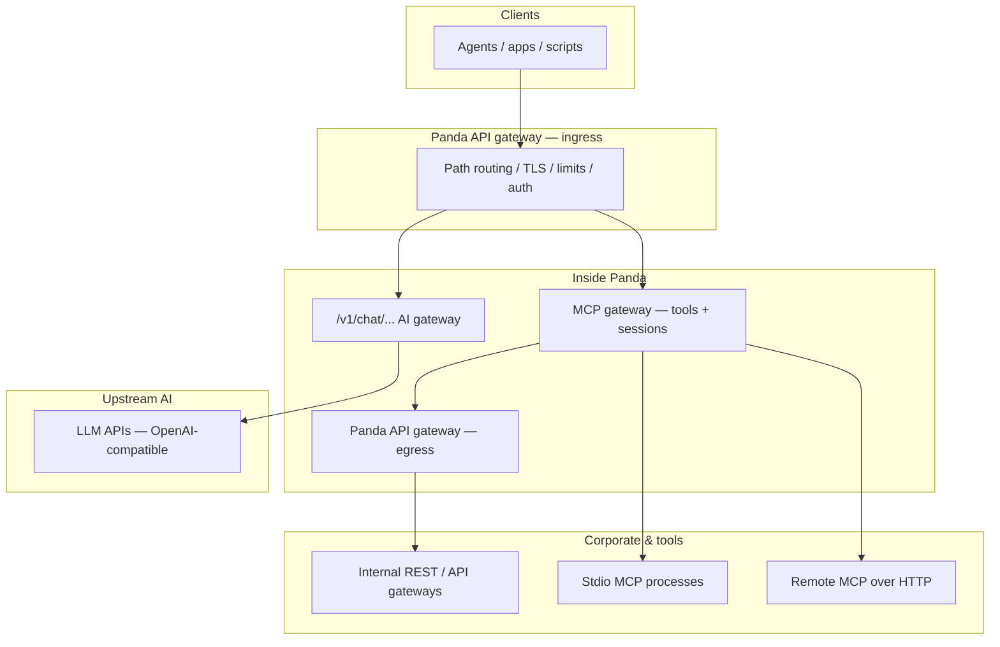
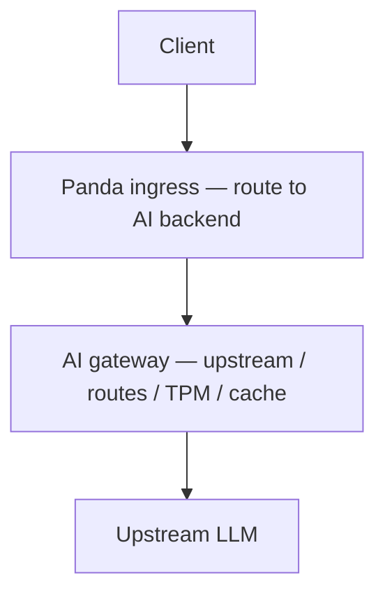
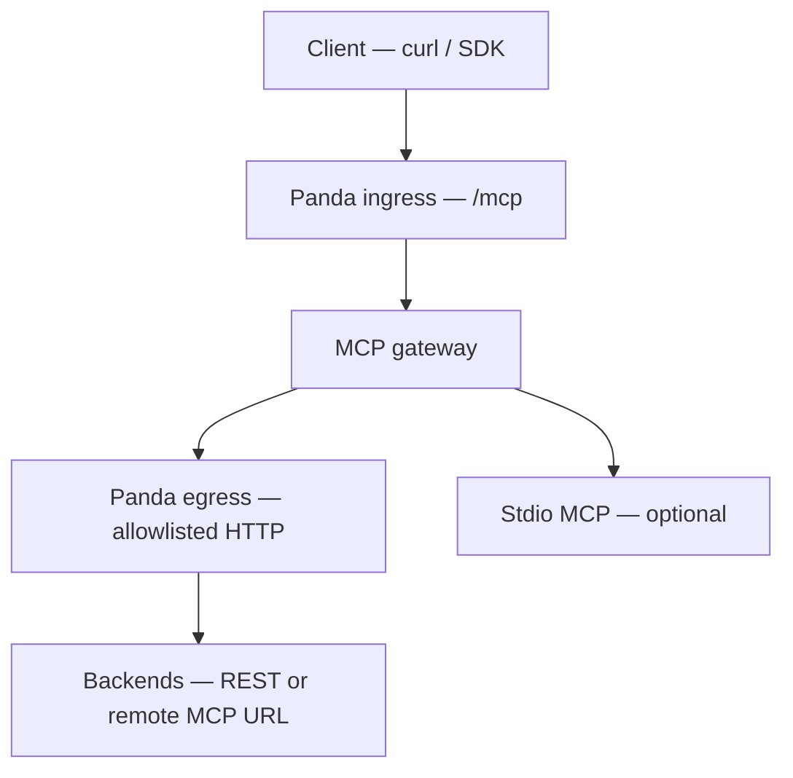
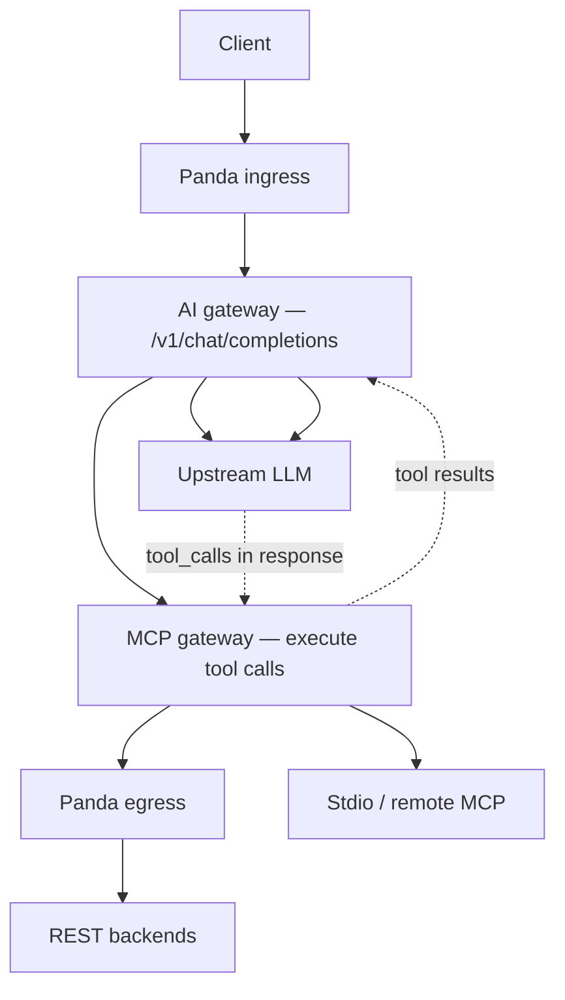
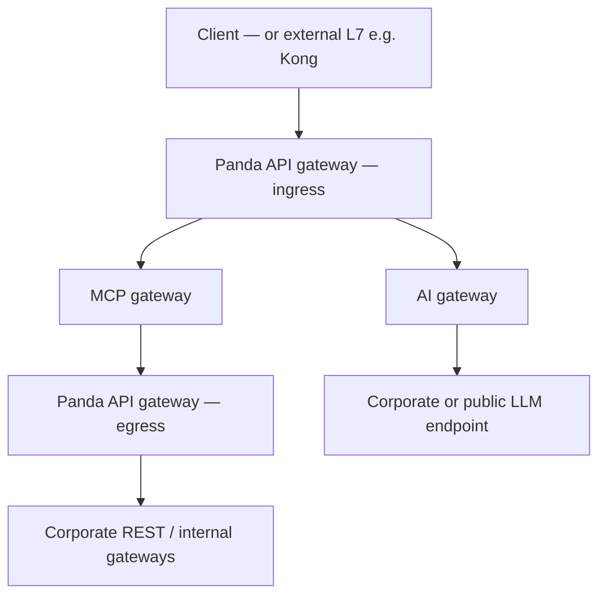

# Panda usage scenarios — MCP gateway, API gateway, and AI gateway

**Purpose:** One-page summary of **how Panda is used** when you combine its three main concerns: **Panda API gateway** (ingress / egress), **MCP gateway** (tools), and **AI gateway** (upstream LLMs). Diagrams are **top-down** (higher = closer to the client).

**See also:** [`architecture_two_pillars.md`](./architecture_two_pillars.md), [`panda_data_flow.md`](./panda_data_flow.md), [`testing_mcp_api_gateway.md`](./testing_mcp_api_gateway.md).

---

## 1. Three layers (what each part is)

| Layer | YAML / code area | Responsibility |
|-------|------------------|----------------|
| **Panda API gateway — ingress** | `api_gateway.ingress` | Route HTTP **into** Panda: TLS, path prefixes, `backend: mcp` vs `ai`, rate limits, auth at the edge of MCP/chat. |
| **Panda MCP gateway** | `mcp` | Tool **catalog**, **execution** (`McpRuntime`): stdio MCP, **remote MCP HTTP** (`remote_mcp_url`), **REST tools** (`http_tool` / `http_tools` via egress). OpenAI tool bridge on chat. |
| **Panda API gateway — egress** | `api_gateway.egress` | Governed HTTP **out** from MCP tools toward **corporate** URLs: `default_base`, **allowlists**, mTLS, retries. |
| **AI gateway (outbound)** | `upstream`, `routes`, `outbound/*` | **OpenAI-shaped** traffic to **upstream LLMs**: streaming, TPM, semantic cache, adapters, semantic routing, model failover. |

Ingress and egress are **one** API-gateway component in two **positions** (in front of MCP vs behind MCP). The **AI gateway** shares the same process and listener but is a **separate data plane** (LLM hops vs tool egress).

---

## 2. Reference diagram — full stack (all three families)

Top = caller; bottom = external systems Panda does not own.

- **Chat path:** `A → ingress → /v1/chat/... → LLM` (AI gateway). If MCP tools are enabled, **MCP** injects tools and executes calls in a **loop** without drawing another box above LLM.
- **Direct MCP path:** `A → ingress → POST /mcp` → **MCP** only (no LLM unless your client calls one elsewhere).
- **REST tools:** `MCP → egress → REST`.

---

## 3. Scenario A — AI gateway only (no MCP)

Use when you only need a **governed OpenAI-compatible proxy** (budgets, cache, routing, failover).

**Typical config:** `upstream` or `routes`, `mcp.enabled: false` (or no tool servers). **Egress** unused for tools.

---

## 4. Scenario B — MCP gateway + egress (no chat LLM in tool path)

Use for **integration tests**, **scripts**, or **headless** automation: JSON-RPC **`POST /mcp`**, tools hit **REST** or **remote MCP** via egress.

**No upstream LLM** in this path: the caller sends **`tools/call`** with a concrete tool name. **YAML:** `api_gateway.ingress`, `mcp`, `api_gateway.egress` for `http_tool(s)` / `remote_mcp_url`.

---

## 5. Scenario C — AI gateway + MCP (chat with tools)

Use for **assistant** flows: the **LLM** chooses tools; Panda **injects** tool definitions and **runs** `McpRuntime` on each tool call, then sends results back to the model.

**Note:** The **dashed** lines are logical (response contains tool calls; follow-up request carries tool results). **YAML:** `mcp`, `upstream`/`routes`, optional `api_gateway.egress` for REST tools.

---

## 6. Scenario D — Full stack (ingress + MCP + egress + AI)

Typical **enterprise** shape: one listener, **chat** to the org’s models, **MCP** for tools, **egress** only to approved internal hosts.

Same process can serve **both** `POST /mcp` and `/v1/chat/completions` depending on path and config.

---

## 7. Quick matrix — which subsystem is involved

| Scenario | Ingress | MCP | Egress | AI gateway (LLM) |
|----------|---------|-----|--------|------------------|
| Proxy chat only | yes | no | no | yes |
| Direct `POST /mcp` | yes | yes | if REST/remote tools | no |
| Chat + MCP tools | yes | yes | if REST tools | yes |
| REST tools without ingress MCP | yes | yes | yes | optional chat on other paths |
| Stdio-only MCP, no corporate HTTP | yes | yes | no | optional |

---

## 8. Optional external edge

Many deployments place **Kong / NGINX / cloud LB** **above** Panda. That hop is **outside** the diagrams here; Panda still sees **one** northbound HTTP peer. Identity may use **`trusted_gateway`** headers — see [`kong_handshake.md`](./kong_handshake.md).
