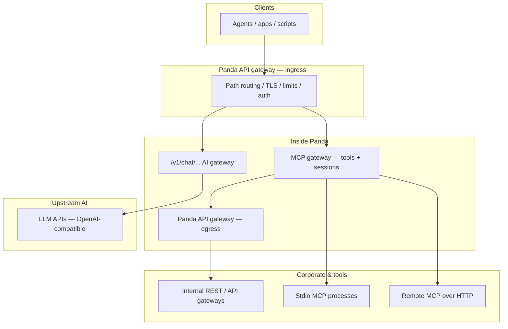
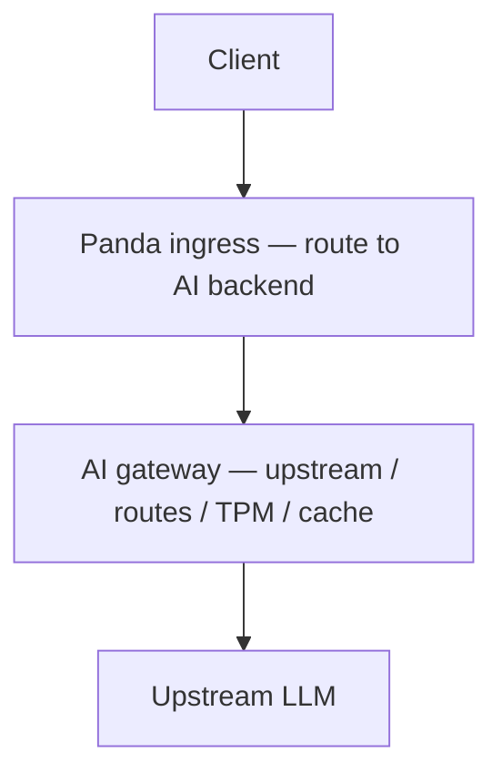
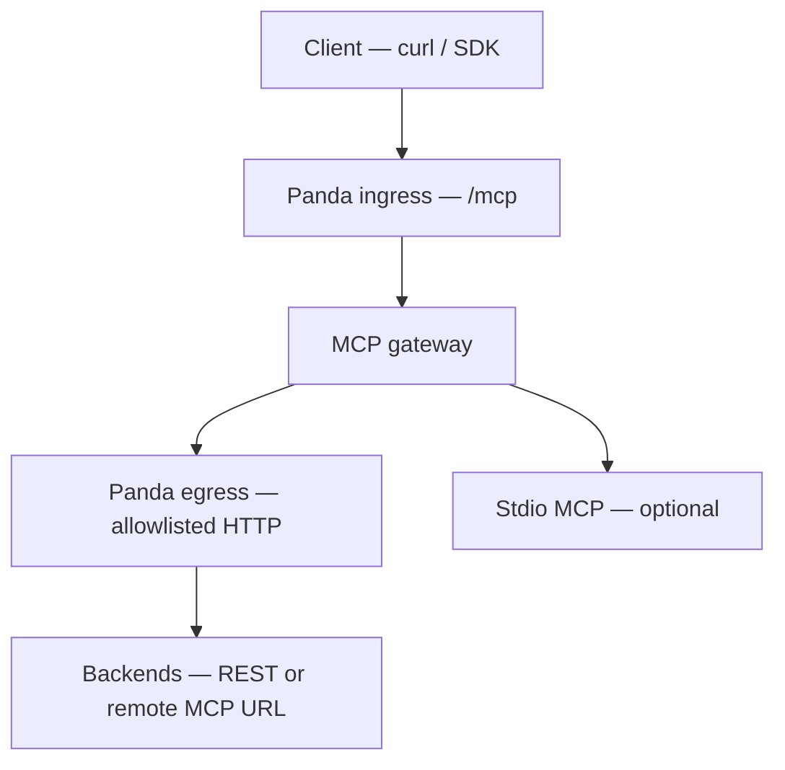
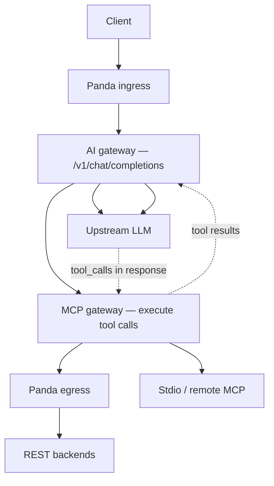
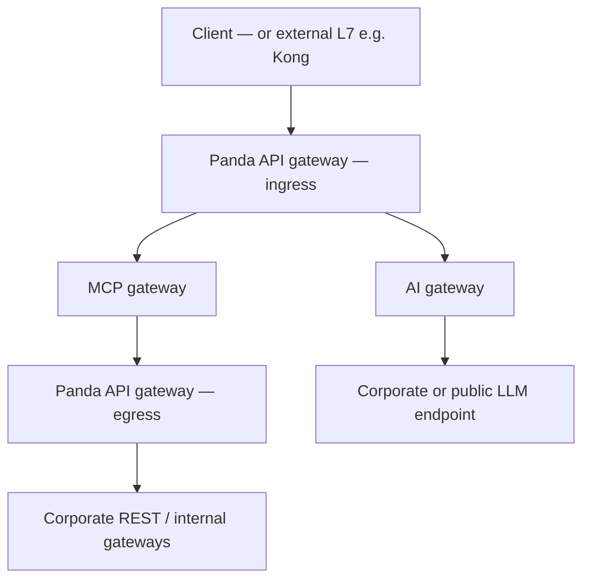
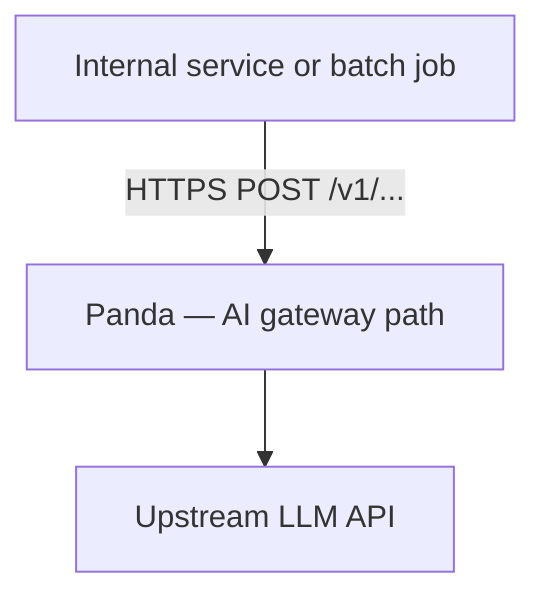

# Panda usage scenarios — MCP gateway, API gateway, and AI gateway

**Purpose:** One-page summary of **how Panda is used** when you combine its three main concerns: **Panda API gateway** (ingress / egress), **MCP gateway** (tools), and **AI gateway** (upstream LLMs). Diagrams are **top-down** (higher = closer to the client).

**See also:** [`architecture_two_pillars.md`](./architecture_two_pillars.md), [`panda_data_flow.md`](./panda_data_flow.md), [`testing_mcp_api_gateway.md`](./testing_mcp_api_gateway.md).

---

## Design goals — MCP gateway + API gateway + AI gateway together

**Goal:** One **`panda-server`** process can act as **both** an **MCP gateway** (tools, `POST /mcp`, optional chat tool loops) and a **generic HTTP / API gateway** (path-based **`routes`** to upstreams, ingress table when enabled). Internal services that only need an **LLM** should use the **AI gateway** path **without** automatically merging the full MCP tool catalog into every chat request.

**Verified logic (implementation):**

| Topic | Behavior | Where |
|-------|----------|--------|
| **AI gateway vs MCP egress** | **LLM** traffic: client → Panda → **`upstream`** / **`routes`** (`forward_to_upstream`). **Corporate REST for tools:** MCP → **`api_gateway.egress`** only. These are **different** hops. | `lib.rs` `forward_to_upstream` vs `EgressClient` from MCP |
| **When merged MCP tools are injected** | Only for **`POST /v1/chat/completions`**, JSON body, **`mcp` runtime present**, **`mcp.enabled`**, effective advertise **true**, and **no** opt-out header. | `should_advertise_mcp_tools` |
| **Effective advertise flag** | **`routes[].mcp_advertise_tools`** (longest prefix) overrides **`mcp.advertise_tools`**; if no route matches, **global** applies. | `effective_mcp_advertise_tools_for_path` |
| **Per-request opt-out** | **`X-Panda-MCP-Advertise: false`** (or **`0`**, **`no`**, **`off`**) | `header_opt_out_mcp_advertise` |
| **Client-supplied tools** | Non-empty **`tools`** array in JSON → Panda **does not** overwrite with merged MCP list. | `inject_openai_tools_into_chat_body` |
| **Internal API → LLM, no injection** | Prefer **`mcp_advertise_tools: false`** on the matching **`routes`** row (or global **`advertise_tools: false`** with **no** conflicting longer prefix), and/or the **opt-out header** on each call. | Same as above |
| **Ingress enabled** | Unmatched paths → **404** (`ingress: no matching route`); must declare prefixes or use ingress **off** for legacy “catch-all” proxy behavior. | `dispatch` + `ingress.rs` |

**Caveats:** **`mcp_advertise_tools: true`** on a route requires **`mcp.enabled: true`** (config validation). Empty **`tools: []`** still allows injection if advertise is effective—use **route**, **header**, or **non-empty client `tools`** to control behavior.

---

## 1. Three layers (what each part is)

| Layer | YAML / code area | Responsibility |
|-------|------------------|----------------|
| **Panda API gateway — ingress** | `api_gateway.ingress` | Route HTTP **into** Panda: TLS, path prefixes, `backend: mcp` vs `ai`, rate limits, auth at the edge of MCP/chat. |
| **Panda MCP gateway** | `mcp` | Tool **catalog**, **execution** (`McpRuntime`): stdio MCP, **remote MCP HTTP** (`remote_mcp_url`), **REST tools** (`http_tool` / `http_tools` via egress). OpenAI tool bridge on chat. |
| **Panda API gateway — egress** | `api_gateway.egress` | Governed HTTP **out** from MCP tools toward **corporate** URLs: `default_base`, **allowlists**, mTLS, retries. |
| **AI gateway (outbound)** | `upstream`, `routes`, `outbound/*` | **OpenAI-shaped** traffic to **upstream LLMs**: streaming, TPM, semantic cache, adapters, semantic routing, model failover. |

Ingress and egress are **one** API-gateway component in two **positions** (in front of MCP vs behind MCP). The **AI gateway** shares the same process and listener but is a **separate data plane** (LLM hops vs tool egress).

---

## 2. Reference diagram — full stack (all three families)

Top = caller; bottom = external systems Panda does not own.



- **Chat path:** `A → ingress → /v1/chat/... → LLM` (AI gateway). If MCP tools are enabled, **MCP** injects tools and executes calls in a **loop** without drawing another box above LLM.
- **Direct MCP path:** `A → ingress → POST /mcp` → **MCP** only (no LLM unless your client calls one elsewhere).
- **REST tools:** `MCP → egress → REST`.

---

## 3. Scenario A — AI gateway only (no MCP)

Use when you only need a **governed OpenAI-compatible proxy** (budgets, cache, routing, failover).



**Typical config:** `upstream` or `routes`, `mcp.enabled: false` (or no tool servers). **Egress** unused for tools.

---

## 4. Scenario B — MCP gateway + egress (no chat LLM in tool path)

Use for **integration tests**, **scripts**, or **headless** automation: JSON-RPC **`POST /mcp`**, tools hit **REST** or **remote MCP** via egress.



**No upstream LLM** in this path: the caller sends **`tools/call`** with a concrete tool name. **YAML:** `api_gateway.ingress`, `mcp`, `api_gateway.egress` for `http_tool(s)` / `remote_mcp_url`.

---

## 5. Scenario C — AI gateway + MCP (chat with tools)

Use for **assistant** flows: the **LLM** chooses tools; Panda **injects** tool definitions and **runs** `McpRuntime` on each tool call, then sends results back to the model.



**Note:** The **dashed** lines are logical (response contains tool calls; follow-up request carries tool results). **YAML:** `mcp`, `upstream`/`routes`, optional `api_gateway.egress` for REST tools.

---

## 6. Scenario D — Full stack (ingress + MCP + egress + AI)

Typical **enterprise** shape: one listener, **chat** to the org’s models, **MCP** for tools, **egress** only to approved internal hosts.



Same process can serve **both** `POST /mcp` and `/v1/chat/completions` depending on path and config.

---

## 7. Quick matrix — which subsystem is involved

| Scenario | Ingress | MCP | Egress | AI gateway (LLM) |
|----------|---------|-----|--------|------------------|
| Proxy chat only | yes | no | no | yes |
| Direct `POST /mcp` | yes | yes | if REST/remote tools | no |
| Chat + MCP tools | yes | yes | if REST tools | yes |
| REST tools without ingress MCP | yes | yes | yes | optional chat on other paths |
| Stdio-only MCP, no corporate HTTP | yes | yes | no | optional |

---

## 8. Optional external edge

Many deployments place **Kong / NGINX / cloud LB** **above** Panda. That hop is **outside** the diagrams here; Panda still sees **one** northbound HTTP peer. Identity may use **`trusted_gateway`** headers — see [`kong_handshake.md`](./kong_handshake.md).

---

## 9. FAQ — traditional REST routing and internal services calling an LLM

### Q1: Does Panda act like a “traditional” API gateway (ingress → arbitrary REST upstream)?

**Partly — it is HTTP reverse proxy + path routing, not a full Kong-style product.**

| Config | What happens |
|--------|----------------|
| **`api_gateway.ingress.enabled: false`** | Requests that are not handled by built-in ops/MCP paths fall through to **`forward_to_upstream`**. The upstream base comes from top-level **`upstream`** and optional **`routes`** (longest **`path_prefix`** wins). That path proxies **generic HTTP** to the chosen base — suitable for **traditional REST** backends. See **`RouteConfig`** in config (`path_prefix` + `upstream`). |
| **`api_gateway.ingress.enabled: true`** | Every request path must **match an ingress row** (static YAML, built-in defaults when `routes` is empty, or control-plane dynamic routes). **Unmatched paths return 404** (`ingress: no matching route`). To expose a **non-MCP** HTTP API through ingress, add a row whose **`backend`** is **`ai`** (the code path that calls **`forward_to_upstream`**) and set **`upstream`** on that row and/or rely on **`routes`** for base resolution. The name **`ai`** refers to the existing **proxy** stack (chat, embeddings, etc.), not “only LLM.” |

So: **yes**, you can route **ingress → REST** without MCP, but with ingress **on** you must **declare** the prefix; with ingress **off**, **`routes`** + **`upstream`** behave like a **lightweight path-based reverse proxy**.

### Q2: Can an internal company API (or backend job) call an LLM **through** Panda’s AI gateway?

**Yes.** Anything that can send HTTP to Panda can use the **same OpenAI-shaped endpoints** the AI gateway implements — typically **`POST /v1/chat/completions`**, **`/v1/embeddings`**, etc. — depending on your **`routes`** and **`upstream`**. That traffic is handled by **`forward_to_upstream`** and the **outbound** stack (TPM, optional semantic cache, adapters, semantic routing, failover, …), **not** by MCP egress.



**Not** the same path as MCP tools: **`api_gateway.egress`** is for **MCP tool** calls **out** to **corporate REST**. **LLM** calls are **northbound clients → Panda → LLM** via **`upstream`** / **`routes`**.

**Summary:** Internal APIs that need the LLM should call **Panda’s listener** on the **chat/completions (or other AI) paths**, with auth/network policy as you would for any client. They do **not** need to go through **`POST /mcp`** unless you design that flow yourself.

### Q3: Does every `POST /v1/chat/completions` through Panda get **all MCP tools** injected?

**No.** Injection is **conditional** (`should_advertise_mcp_tools` in `panda-proxy`). Roughly: MCP must be on, path must be **`/v1/chat/completions`**, JSON body, and the **effective** advertise flag must be true (see below).

| Condition | Meaning |
|-----------|---------|
| **`mcp` runtime present** | `McpRuntime` connected (`mcp.enabled` and at least one enabled server). |
| **`mcp.enabled: true`** | MCP feature on. |
| **Effective advertise** | Global **`mcp.advertise_tools`**, overridden by the longest matching **`routes[]`** row **`mcp_advertise_tools`** when set. |
| **No opt-out header** | **`X-Panda-MCP-Advertise: false`** (or **`0`**, **`no`**, **`off`**) disables injection for that single request. |
| **`POST`**, path **`/v1/chat/completions`**, JSON **`Content-Type`** | Other paths (e.g. **`/v1/embeddings`**) do not use this inject path. |

**Per-route (`routes[].mcp_advertise_tools`):** Same longest-prefix rules as **`upstream`**. Lets one process mix **plain AI proxy** prefixes ( **`mcp_advertise_tools: false`** ) and **MCP-rich** chat ( **`true`** ). Setting **`mcp_advertise_tools: true`** on a route requires **`mcp.enabled: true`** (config validation).

**Per-request header:** **`X-Panda-MCP-Advertise: false`** when route/global would inject but this call must not (e.g. batch).

**Client `tools` array:** If the body already has a **non-empty** `tools` array, Panda **does not** replace it. **`"tools": []`** does not block injection unless route/header disables it.

**Example:**

```yaml
mcp:
  enabled: true
  advertise_tools: false
  servers: [ ... ]
routes:
  - path_prefix: /v1/internal-chat
    upstream: "http://internal-llm"
    mcp_advertise_tools: false
  - path_prefix: /v1/chat
    upstream: "https://api.openai.com/v1"
    mcp_advertise_tools: true
```

Both prefixes match **`/v1/chat/completions`**; the **longer** matching prefix wins (`/v1/chat` is longer than `/v1` if both exist—order routes so the intended prefix wins; duplicate path_prefixes are rejected at load).
